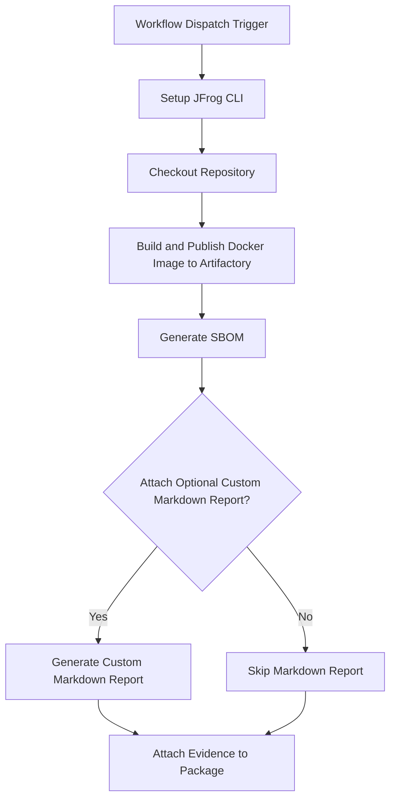

# Anchore SBOM Evidence Integration Example

This example demonstrates how to automate SBOM generation for Docker images using Anchore and attach the SBOM as signed evidence to the image in JFrog Artifactory using GitHub Actions and JFrog CLI.
This repository provides a working example of a GitHub Actions workflow that automates the creation of a Software Bill of Materials (SBOM) for a Docker image using Anchore's Syft. It then attaches the resulting SBOM as signed, verifiable evidence to the image in JFrog Artifactory.


## Overview

The workflow builds a Docker image, generates an SBOM (Software Bill of Materials) using Anchore, pushes the image to Artifactory, and attaches the SBOM as evidence to the image package. This enables traceability and compliance for software composition analysis in your CI/CD pipeline.

### **Key Features**

* **Automated Build**: Builds a Docker image from a `Dockerfile`.  
* **SBOM Generation**: Uses the `anchore/sbom-action` to generate a comprehensive SBOM in JSON format.  
* **Optional Markdown Summary**: Includes a helper script to generate a human-readable Markdown report from the JSON SBOM.  
* **Signed Evidence Attachment**: Attaches the JSON SBOM as a predicate to the corresponding Docker image in Artifactory, cryptographically signing the evidence for integrity.

## Prerequisites

- JFrog CLI 2.65.0 or above (installed automatically in the workflow)
- Artifactory configured as a Docker registry
- The following GitHub repository variables:
    - `JF_URL` (Artifactory Docker registry domain, e.g. `mycompany.jfrog.io`)
    - `ARTIFACTORY_URL` (Artifactory base URL)
    - `EVIDENCE_KEY_ALIAS` (Key alias for signing evidence)
- The following GitHub repository secrets:
    - `ARTIFACTORY_ACCESS_TOKEN` (Artifactory access token)
    - `PRIVATE_KEY` (Private key for signing evidence)

## Environment Variables Used

- `REGISTRY_DOMAIN` - Docker registry domain
- `REPO_NAME` - Repository name for the Docker image
- `IMAGE_NAME` - Name of the Docker image
- `VERSION` - Version of the Docker image
- `BUILD_NAME` - Build name for the Docker image
- `ATTACH_OPTIONAL_CUSTOM_MARKDOWN_TO_EVIDENCE` - Whether to attach custom markdown reports to evidence

## Workflow



## Example Usage

You can trigger the workflow manually from the GitHub Actions tab. The workflow will:

- Build the Docker image
- Generate an SBOM for the image
- Push the image to Artifactory
- Attach the SBOM as evidence

## Key Commands Used

- **Build Docker Image:**
  * The workflow first builds the Docker image from the specified `Dockerfile` and pushes it to your Artifactory instance using the standard `docker` and `jf rt` commands.
    
  ```bash
  docker build . --file ./examples/anchore/Dockerfile --tag $REGISTRY_DOMAIN/$REPO_NAME/$IMAGE_NAME:$VERSION
  ```
- **Push Docker Image:**
  ```bash
  jf rt docker-push $REGISTRY_DOMAIN/$REPO_NAME/$IMAGE_NAME:$VERSION $REPO_NAME
  ```
- **Generate SBOM:**
  This step uses the `anchore/sbom-action`, which leverages the powerful open-source tool **Syft**, to scan the Docker image and generate a detailed SBOM. The output is saved as a JSON file.
  
  ```yaml
  uses: anchore/sbom-action@v0
  with:
    image: ${{ env.REGISTRY_DOMAIN }}/${{ env.REPO_NAME }}/${{ env.IMAGE_NAME }}:${{ env.VERSION }}
    output-file: anchore-sbom.json
  ```
- **Attach Evidence:**
  This final step uses `jf evd create` to attach the SBOM to the Docker image that was built at the start. The JSON SBOM serves as the official, machine-readable predicate, while the optional Markdown report provides a summary for easy viewing in the Artifactory UI.
  
  ```bash
  jf evd create \
    --package-name $IMAGE_NAME \
    --package-version $VERSION \
    --package-repo-name $REPO_NAME \
    --key "${{ secrets.PRIVATE_KEY }}" \
    --key-alias "${{ vars.EVIDENCE_KEY_ALIAS }}" \
    --predicate ./anchore-sbom.json \
    --predicate-type http://anchore.com/syft/sbom/v1
  ```

## References

- [Anchore Documentation](https://anchore.com/)
- [JFrog Evidence Management](https://jfrog.com/help/r/jfrog-artifactory-documentation/evidence-management)
- [JFrog CLI Documentation](https://jfrog.com/getcli/)
