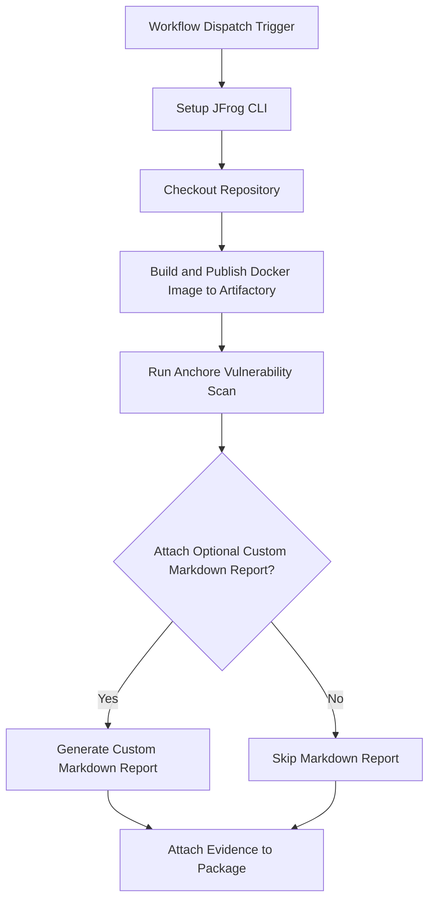

# Anchore Scan Evidence Integration Example

This repository provides a working example of a GitHub Actions workflow that automates container vulnerability scanning using Anchore's Grype. It then attaches the resulting SARIF report as signed, verifiable evidence to the scanned Docker image in JFrog Artifactory.

This workflow is a key DevSecOps practice, creating a transparent and auditable security record for every software build.

## Overview

The workflow builds a Docker image, scans it with Anchore for vulnerabilities, pushes the image to Artifactory, and attaches the Anchore scan results as evidence to the image package. This enables traceability and compliance for security scanning in your CI/CD pipeline.

### **Key Features**

* **Automated Build**: Builds a Docker image from a `Dockerfile`.  
* **Vulnerability Scanning**: Uses the `anchore/scan-action` (which leverages Grype) to scan the Docker image for known vulnerabilities.  
* **SARIF Output**: Generates an industry-standard SARIF file detailing the scan's findings.  
* **Optional Markdown Summary**: Includes a helper script to generate a human-readable Markdown report from the SARIF data.  
* **Signed Evidence Attachment**: Attaches the SARIF report as a predicate to the corresponding Docker image in Artifactory, cryptographically signing the evidence for integrity.

## Prerequisites

- JFrog CLI 2.65.0 or above (installed automatically in the workflow)
- Artifactory configured as a Docker registry
- The following GitHub repository variables:
    - `JF_URL` (Artifactory Docker registry domain, e.g. `mycompany.jfrog.io`)
    - `ARTIFACTORY_URL` (Artifactory base URL)
    - `EVIDENCE_KEY_ALIAS` (Key alias for signing evidence)
- The following GitHub repository secrets:
    - `ARTIFACTORY_ACCESS_TOKEN` (Artifactory access token)
    - `PRIVATE_KEY` (Private key for signing evidence)

## Environment Variables Used

- `REGISTRY_DOMAIN` - Docker registry domain
- `REPO_NAME` - Repository name for the Docker image
- `IMAGE_NAME` - Name of the Docker image
- `VERSION` - Version of the Docker image
- `BUILD_NAME` - Build name for the Docker image
- `ATTACH_OPTIONAL_CUSTOM_MARKDOWN_TO_EVIDENCE` - Whether to attach custom markdown reports to evidence

## Workflow



## Example Usage

You can trigger the workflow manually from the GitHub Actions tab. The workflow will:

- Build and scan the Docker image
- Push the image to Artifactory
- Attach the Anchore scan results as evidence

## Key Commands Used

- **Build Docker Image:**
  The workflow first builds the Docker image from the specified `Dockerfile` and pushes it to your Artifactory instance using standard `docker` and `jf rt` commands.
  
  ```bash
  docker build . --file ./examples/anchore/Dockerfile --tag $REGISTRY_DOMAIN/$REPO_NAME/$IMAGE_NAME:$VERSION
  ```
- **Push Docker Image:**
  ```bash
  jf rt docker-push $REGISTRY_DOMAIN/$REPO_NAME/$IMAGE_NAME:$VERSION $REPO_NAME
  ```
- **Run Anchore Scan:**
  This step uses the `anchore/scan-action`, which leverages the powerful open-source tool **Grype**, to scan the Docker image for vulnerabilities. The results are saved as a SARIF file. The `fail-build: false` parameter ensures the workflow continues even if vulnerabilities are found, allowing the results to be attached as evidence.
  
  ```yaml
  uses: anchore/scan-action@v6
  with:
    image: ${{ env.REGISTRY_DOMAIN }}/${{ env.REPO_NAME }}/${{ env.IMAGE_NAME }}:${{ env.VERSION }}
    output-format: sarif
    output-file: anchore-scan-results.sarif
    fail-build: false
  ```
- **Attach Evidence:**
  This final step uses jf evd create to attach the scan results to the Docker image built earlier. The SARIF file serves as the official, machine-readable predicate, while the optional Markdown report provides a summary for easy viewing in the Artifactory UI.
  
  ```bash
  jf evd create \
    --package-name $IMAGE_NAME \
    --package-version $VERSION \
    --package-repo-name $REPO_NAME \
    --key "${{ secrets.PRIVATE_KEY }}" \
    --key-alias "${{ vars.EVIDENCE_KEY_ALIAS }}" \
    --predicate ./anchore-scan-results.sarif \
    --provider-id "anchore" \
    --predicate-type http://anchore.com/grype/vulnerabilities/v1
  ```

## References

- [Anchore Documentation](https://anchore.com/)
- [JFrog Evidence Management](https://jfrog.com/help/r/jfrog-artifactory-documentation/evidence-management)
- [JFrog CLI Documentation](https://jfrog.com/getcli/)
