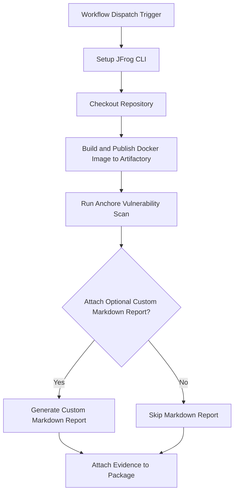

# Anchore Scan Evidence Integration Example

This example demonstrates how to automate Anchore scanning for Docker images and attach the scan results as signed evidence to the image in JFrog Artifactory using GitHub Actions and JFrog CLI.

## Overview

The workflow builds a Docker image, scans it with Anchore for vulnerabilities, pushes the image to Artifactory, and attaches the Anchore scan results as evidence to the image package. This enables traceability and compliance for security scanning in your CI/CD pipeline.

## Prerequisites

- JFrog CLI 2.65.0 or above (installed automatically in the workflow)
- Artifactory configured as a Docker registry
- The following GitHub repository variables:
    - `JF_URL` (Artifactory Docker registry domain, e.g. `mycompany.jfrog.io`)
    - `ARTIFACTORY_URL` (Artifactory base URL)
    - `EVIDENCE_KEY_ALIAS` (Key alias for signing evidence)
- The following GitHub repository secrets:
    - `ARTIFACTORY_ACCESS_TOKEN` (Artifactory access token)
    - `PRIVATE_KEY` (Private key for signing evidence)

## Environment Variables Used

- `REGISTRY_DOMAIN` - Docker registry domain
- `REPO_NAME` - Repository name for the Docker image
- `IMAGE_NAME` - Name of the Docker image
- `VERSION` - Version of the Docker image
- `BUILD_NAME` - Build name for the Docker image
- `ATTACH_OPTIONAL_CUSTOM_MARKDOWN_TO_EVIDENCE` - Whether to attach custom markdown reports to evidence

## Workflow



## Example Usage

You can trigger the workflow manually from the GitHub Actions tab. The workflow will:

- Build and scan the Docker image
- Push the image to Artifactory
- Attach the Anchore scan results as evidence

## Key Commands Used

- **Build Docker Image:**
  ```bash
  docker build . --file ./examples/anchore/Dockerfile --tag $REGISTRY_DOMAIN/$REPO_NAME/$IMAGE_NAME:$VERSION
  ```
- **Push Docker Image:**
  ```bash
  jf rt docker-push $REGISTRY_DOMAIN/$REPO_NAME/$IMAGE_NAME:$VERSION $REPO_NAME
  ```
- **Run Anchore Scan:**
  ```yaml
  uses: anchore/scan-action@v6
  with:
    image: ${{ env.REGISTRY_DOMAIN }}/${{ env.REPO_NAME }}/${{ env.IMAGE_NAME }}:${{ env.VERSION }}
    output-format: sarif
    output-file: anchore-scan-results.sarif
    fail-build: false
  ```
- **Attach Evidence:**
  ```bash
  jf evd create \
    --package-name $IMAGE_NAME \
    --package-version $VERSION \
    --package-repo-name $REPO_NAME \
    --key "${{ secrets.PRIVATE_KEY }}" \
    --key-alias "${{ vars.EVIDENCE_KEY_ALIAS }}" \
    --predicate ./anchore-scan-results.sarif \
    --predicate-type http://anchore.com/grype/vulnerabilities/v1
  ```

## References

- [Anchore Documentation](https://anchore.com/)
- [JFrog Evidence Management](https://jfrog.com/help/r/jfrog-artifactory-documentation/evidence-management)
- [JFrog CLI Documentation](https://jfrog.com/getcli/)
