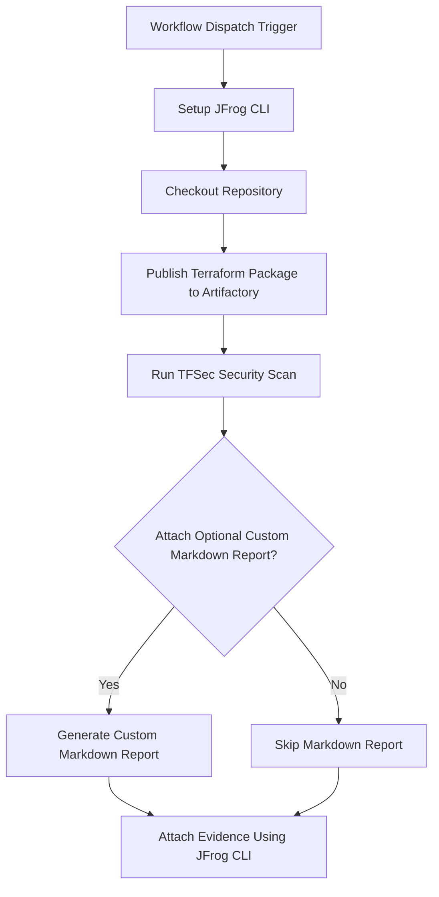

# TFSec Security Scan Evidence Example

This repository provides a working example of a GitHub Actions workflow that automates Infrastructure as Code (IaC) scanning using Aqua Security's TFsec. It then attaches the resulting security report as signed, verifiable evidence to the build information in JFrog Artifactory.

This workflow is a key DevSecOps practice, enabling you to "shift left" by catching potential misconfigurations in your Terraform code early and creating an auditable security record for your infrastructure deployments.

## Overview

The workflow scans Terraform code with TFSec for security issues, publishes the package to Artifactory, and
attaches the TFSec scan results as evidence to the package. This enables traceability and compliance for security
scanning in your CI/CD pipeline.

### **Key Features**

* **Terraform Module Publishing**: Packages and publishes Terraform code as a versioned module to a Terraform repository in Artifactory.  
* **IaC Security Scanning**: Uses the `aquasecurity/tfsec-action` to scan Terraform code for security vulnerabilities and misconfigurations.  
* **JSON Report Generation**: Generates a detailed JSON report of the scan's findings.  
* **Optional Markdown Summary**: Includes a helper script to generate a human-readable Markdown report from the JSON data.  
* **Signed Evidence on Build**: Attaches the JSON report as a predicate to the corresponding **build** in Artifactory, providing a verifiable link between a CI run and its security posture.

## Prerequisites

- JFrog CLI 2.65.0 or above (installed automatically in the workflow)
- Artifactory configured as a repository
- The following GitHub repository variables:
    - `ARTIFACTORY_URL` (Artifactory base URL)
    - `EVIDENCE_KEY_ALIAS` (Key alias for signing evidence)
- The following GitHub repository secrets:
    - `ARTIFACTORY_ACCESS_TOKEN` (Artifactory access token)
    - `PRIVATE_KEY` (Private key for signing evidence)

## Environment Variables Used

- `ATTACH_OPTIONAL_CUSTOM_MARKDOWN_TO_EVIDENCE` - Whether to attach a custom markdown report to the evidence

## Workflow



## Example Usage

You can trigger the workflow manually from the GitHub Actions tab. The workflow will:

- Scan the Terraform code
- Publish the package to Artifactory
- Attach the TFSec scan results as evidence

## Key Commands Used

- **Publish Terraform Package:**
  The workflow begins by configuring the JFrog CLI for Terraform and then publishes the code in the `examples/aquasecurity/tfsec` directory as a versioned module to your Artifactory instance. It concludes by publishing the associated build information.
  
  ```bash
  jf tfc --repo-deploy tf-local \
    --server-id-deploy setup-jfrog-cli-server
  jf tf p --namespace example \
    --provider aws \
    --tag v0.0.${{ github.run_number }} \
    --build-name my-tf-build \
    --build-number ${{ github.run_number }}
  jf rt bp my-tf-build ${{ github.run_number }}
  ```
- **Run TFSec Scan:**
  This step uses the aquasecurity/tfsec-action to scan the Terraform code for potential security issues. The results are saved as a tfsec.json file. The soft_fail: true parameter ensures the workflow continues even if issues are found, allowing the results to be attached as evidence.
  
  ```yaml
  uses: aquasecurity/tfsec-action@v1.0.0
  with:
    additional_args: --format json --out tfsec.json
    soft_fail: true
  ```
- **Attach Evidence:**
  This final step uses `jf evd create --build-name` to attach the scan results to the **build information** that was published in the first step. This creates a verifiable link between the CI process and its security posture.
  
  ```bash
  jf evd create \
    --build-name my-tf-build \
    --build-number ${{ github.run_number }} \
    --key "${{ secrets.PRIVATE_KEY }}" \
    --key-alias "${{ vars.EVIDENCE_KEY_ALIAS }}" \
    --predicate ./tfsec.json \
    --predicate-type http://aquasec.com/tfsec/security-scan \
    ${{ env.ATTACH_OPTIONAL_CUSTOM_MARKDOWN_TO_EVIDENCE == 'true' && '--markdown "tfsec.md"' || '' }}
  ```

## References

- [TFSec Documentation](https://aquasecurity.github.io/tfsec/)
- [JFrog Evidence Management](https://jfrog.com/help/r/jfrog-artifactory-documentation/evidence-management)
- [JFrog CLI Documentation](https://jfrog.com/getcli/)
