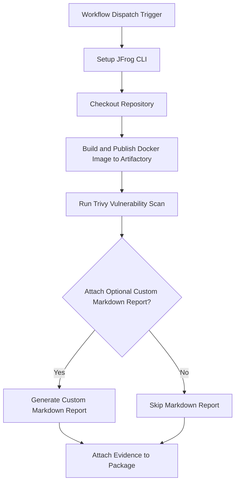

# **Trivy Security Scan Evidence Example**

This repository provides a working example of a GitHub Actions workflow that automates Docker image security scanning using **Trivy**. It then attaches the resulting vulnerability report as signed, verifiable evidence to the package in **JFrog Artifactory**.

This workflow is an essential pattern for DevSecOps, creating a traceable, compliant, and secure software supply chain.

### **Key Features**

* **Automated Build & Push**: Builds a Docker image from a Dockerfile.  
* **Vulnerability Scanning**: Uses the aquasecurity/trivy-action to scan the image for HIGH and CRITICAL vulnerabilities.  
* **Evidence Generation**: Creates a trivy-results.json predicate file.  
* **Optional Markdown Report**: Includes a helper script to generate a human-readable Markdown summary from the Trivy JSON results.  
* **Signed Evidence Attachment**: Attaches the scan results to the corresponding package version in Artifactory using jf evd create, cryptographically signing it for integrity.
* **Trivy**: [what Trivy can scan](https://github.com/aquasecurity/trivy)

### **Workflow**

The following diagram illustrates the sequence of operations performed by the GitHub Actions workflow.




---

### **1\. Prerequisites**

Before running this workflow, you must have:

* JFrog CLI 2.65.0 or above (installed automatically in the workflow)  
* An Artifactory repository of type docker (e.g., docker-trivy-repo).  
* A private key and a corresponding key alias configured in your JFrog Platform for signing evidence.  
* The following GitHub repository variables:  
  * `REGISTRY_DOMAIN` (Artifactory Docker registry domain, e.g. `mycompany.jfrog.io`)  
  * `ARTIFACTORY_URL` (Artifactory base URL)  
  * `TRIVY_TEST_KEY` (Key alias for signing evidence)  
* The following GitHub repository secrets:  
  * `ARTIFACTORY_ACCESS_TOKEN` (Artifactory access token)  
  * `TRIVY_TEST_PKEY` (Private key for signing evidence)

### Environment Variables Used

* `REGISTRY_DOMAIN` \- Docker registry domain

### **2\. Configuration**

To use this workflow, you must configure the following GitHub Repository Secrets and Variables.

#### **GitHub Secrets**

Navigate to Settings \> Secrets and variables \> Actions and create the following secrets:

| Secret Name | Description |
| :---- | :---- | 
| ARTIFACTORY\_ACCESS\_TOKEN | A valid JFrog Access Token with permissions to read, write, and annotate in your target repository. | 
| PRIVATE\_KEY | The private key used to sign the evidence. This key corresponds to the alias configured in JFrog Platform. |

#### **GitHub Variables**

Navigate to Settings \> Secrets and variables \> Actions and create the following variables:

| Variable Name | Description | Example Value |
| :---- | :---- | :---- |
| JF\_URL | The base URL of your JFrog Platform instance. | https://mycompany.jfrog.io |
| EVIDENCE\_KEY\_ALIAS | The alias for the public key in JFrog Platform used to verify the evidence signature. | my-signing-key-alias |

#### **Workflow Environment Variables**

You can also customize the workflow's behavior by modifying the env block in the .github/workflows/trivy-evidence.yml file:

| Variable Name | Description | Default Value |
| :---- | :---- | :---- |
| REPO\_NAME | The name of the target Docker repository in Artifactory. | docker-trivy-repo |
| IMAGE\_NAME | The name of the Docker image to be built and pushed. | docker-trivy-image |
| BUILD\_NAME | The name assigned to the build information in Artifactory. | trivy-docker-build |
| ATTACH\_OPTIONAL\_CUSTOM\_MARKDOWN\_TO\_EVIDENCE | Set to true to generate and attach a Markdown report alongside the JSON evidence. Set to false to skip this step. | true |

---

### 

### 

### 

### 

### **3\. Usage**

This workflow is triggered manually.

1. Navigate to the **Actions** tab of your forked repository.  
2. In the left sidebar, click on the **Trivy evidence integration example** workflow.  
3. Click the **Run workflow** dropdown button. You can leave the default branch selected.  
4. Click the green **Run workflow** button.

Once the workflow completes successfully, you can navigate to your repository in Artifactory (docker-trivy-repo) and view the docker-trivy-image. Under the **Evidence** tab for the latest version, you will find the signed Trivy scan results.

### 

### 

### 

### **How It Works: A Step-by-Step Breakdown**

1. **Setup and Checkout**: The workflow begins by setting up the JFrog CLI and checking out the repository code.  
2. **Build and Publish Docker Image**: It uses standard docker commands to build an image. The jf rt docker-push command then pushes this image to your Artifactory instance and associates it with build information using jf rt build-publish.  
3. **Run Trivy Vulnerability Scan**: The aquasecurity/trivy-action is executed against the newly pushed image. It specifically scans for HIGH and CRITICAL severity vulnerabilities and outputs the findings into a structured trivy-results.json file.  
4. **Generate Optional Markdown Report**: If ATTACH\_OPTIONAL\_CUSTOM\_MARKDOWN\_TO\_EVIDENCE is true, a Python helper script is run to parse the JSON output and create a more human-readable trivy-results.md file.  
5. **Attach Signed Evidence**: The final step uses the jf evd create command. It takes the trivy-results.json file as the official "predicate" and attaches it as evidence to the specific package version in Artifactory. The evidence is signed using the provided PRIVATE\_KEY, ensuring its authenticity and integrity.

   # Key Commands Used

* **Build Docker Image:**

```
docker build . --file ./examples/aquasecurity/trivy-verify-example/Dockerfile --tag $REGISTRY_URL/$REPO_NAME/$IMAGE_NAME:$VERSION
```

* **Run Trivy Scan:**

```
uses: aquasecurity/trivy-action@master
with:
  image-ref: ${{ env.REGISTRY_URL }}/${{ env.REPO_NAME }}/${{ env.IMAGE_NAME }}:${{ env.VERSION }}
  severity: HIGH,CRITICAL
  format: json
  output: trivy-results.json
```

* **Push Docker Image:**

```
jf rt docker-push $REGISTRY_URL/$REPO_NAME/$IMAGE_NAME:$VERSION $REPO_NAME --build-name=$BUILD_NAME --build-number=${{ github.run_number }}
```

* **Attach Evidence:**

```
jf evd create \
  --package-name $IMAGE_NAME \
  --package-version $VERSION \
  --package-repo-name $REPO_NAME \
  --key "${{ secrets.TRIVY_TEST_PKEY }}" \
  --key-alias ${{ vars.TRIVY_TEST_KEY }} \
  --predicate ./trivy-results.json \
  --predicate-type http://aquasec.com/trivy/security-scan
```

### **References**

* [Trivy Documentation](https://aquasecurity.github.io/trivy/)  
* [JFrog Evidence Management](https://jfrog.com/help/r/jfrog-artifactory-documentation/evidence-management)  
* [JFrog CLI Documentation](https://jfrog.com/getcli/)

