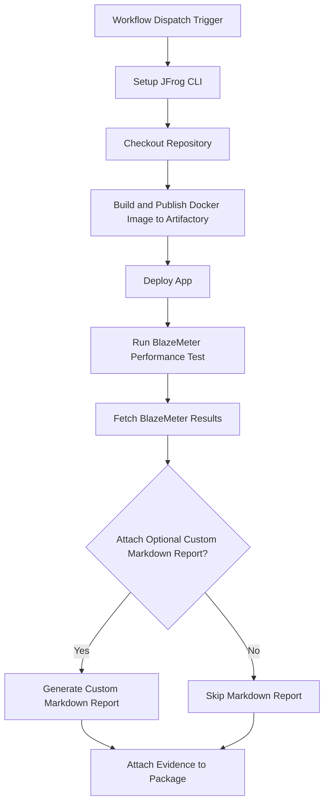

# BlazeMeter Evidence Integration Example

This repository provides a working example of a GitHub Actions workflow that automates performance testing with **BlazeMeter** for a Dockerized application. It then attaches the resulting test results as signed, verifiable evidence to the package in **JFrog Artifactory**.

This workflow is an essential pattern for DevSecOps, creating a traceable, compliant, and secure software supply chain with comprehensive performance testing coverage.

### **Key Features**

* **Automated Build & Push**: Builds a Docker image from a Dockerfile and pushes it to Artifactory.
* **Performance Testing**: Runs a BlazeMeter test using the official GitHub Action.
* **Evidence Generation**: Fetches BlazeMeter aggregate results as a JSON predicate file.
* **Optional Markdown Report**: Includes helper scripts to generate a human-readable Markdown summary from the BlazeMeter test results.
* **Signed Evidence Attachment**: Attaches the test results to the corresponding package version in Artifactory using jf evd create, cryptographically signing it for integrity.
* **BlazeMeter**: [What BlazeMeter can test](https://help.blazemeter.com/docs/guide/intro.html)

### **Workflow**

The following diagram illustrates the sequence of operations performed by the GitHub Actions workflow.



---

### **1. Prerequisites**

Before running this workflow, you must have:

* JFrog CLI 2.65.0 or above (installed automatically in the workflow)
* An Artifactory repository of type docker (e.g., docker-blazemeter-repo)
* A private key and a corresponding key alias configured in your JFrog Platform for signing evidence
* BlazeMeter API credentials and a valid test ID
* The following GitHub repository variables:
  * `JF_URL` (Artifactory Docker registry domain, e.g. `mycompany.jfrog.io`)
  * `ARTIFACTORY_URL` (Artifactory base URL)
* The following GitHub repository secrets:
  * `JF_ACCESS_TOKEN` (Artifactory access token)
  * `BLAZEMETER_API_KEY` (BlazeMeter API key)
  * `BLAZEMETER_API_SECRET` (BlazeMeter API secret)
  * `PRIVATE_KEY` (Private key for signing evidence)
  * `PRIVATE_KEY_ALIAS` (Key alias for signing evidence)

### Environment Variables Used

* `REGISTRY_URL` - Docker registry domain
* `REPO_NAME` - Docker repository name
* `IMAGE_NAME` - Docker image name
* `TAG_NAME` - Docker image tag (uses GitHub run number)
* `BUILD_NAME` - Build name for Artifactory
* `BUILD_NUMBER` - Build number (uses GitHub run number)
* `ATTACH_OPTIONAL_MARKDOWN_TO_EVIDENCE` - Set to `true` to attach a Markdown report as evidence
* `BLAZEMETER_TEST_ID` - BlazeMeter test ID to execute

### **2. Configuration**

To use this workflow, you must configure the following GitHub Repository Secrets and Variables.

#### **GitHub Secrets**

Navigate to Settings > Secrets and variables > Actions and create the following secrets:

| Secret Name | Description |
| :---- | :---- |
| JF_ACCESS_TOKEN | A valid JFrog Access Token with permissions to read, write, and annotate in your target repository. |
| BLAZEMETER_API_KEY | BlazeMeter API key for authentication |
| BLAZEMETER_API_SECRET | BlazeMeter API secret for authentication. |
| PRIVATE_KEY | The private key used to sign the evidence. This key corresponds to the alias configured in JFrog Platform. |
| PRIVATE_KEY_ALIAS | The key alias for signing evidence. |

#### **GitHub Variables**

Navigate to Settings > Secrets and variables > Actions and create the following variables:

| Variable Name | Description | Example Value |
| :---- | :---- | :---- |
| JF_URL | Artifactory Docker registry domain | mycompany.jfrog.io |
| ARTIFACTORY_URL | The Artifactory base URL | https://mycompany.jfrog.io |

#### **Workflow Environment Variables**

You can also customize the workflow's behavior by modifying the env block in the .github/workflows/blazemeter-evidence-example.yml file:

| Variable Name | Description | Default Value |
| :---- | :---- | :---- |
| REPO_NAME | The name of the target Docker repository in Artifactory. | docker-blazemeter-repo |
| IMAGE_NAME | The name of the Docker image to be built and pushed. | docker-blazemeter-image |
| BUILD_NAME | The name assigned to the build information in Artifactory. | blazemeter-docker-build |
| ATTACH_OPTIONAL_MARKDOWN_TO_EVIDENCE | Set to true to generate and attach a Markdown report alongside the JSON evidence. Set to false to skip this step. | true |
| BLAZEMETER_TEST_ID | The BlazeMeter test ID to execute for performance testing. | 14909295 |

---

### **3. Usage**

This workflow is triggered manually.

1. Navigate to the **Actions** tab of your forked repository.
2. In the left sidebar, click on the **BlazeMeter evidence integration example** workflow.
3. Click the **Run workflow** dropdown button. You can leave the default branch selected.
4. Click the green **Run workflow** button.

Once the workflow completes successfully, you can navigate to your repository in Artifactory (docker-blazemeter-repo) and view the docker-blazemeter-image. Under the **Evidence** tab for the latest version, you will find the signed BlazeMeter test results.

---

### **How It Works: A Step-by-Step Breakdown**

1. **Setup and Checkout**: The workflow begins by setting up the JFrog CLI and checking out the repository code.
2. **Build and Publish Docker Image**: It uses standard docker commands to build an image. The jf rt docker-push command then pushes this image to your Artifactory instance and associates it with build information using jf rt build-publish.
3. **Run BlazeMeter Performance Test**: The BlazeMeter GitHub Action is executed for running the specified test ID and generating performance metrics.
4. **Fetch BlazeMeter Results**: The workflow retrieves the latest test run information and downloads the aggregate BlazeMeter results.
5. **Generate Optional Markdown Report**: If ATTACH\_OPTIONAL\_MARKDOWN\_TO\_EVIDENCE is true, a Python helper script is run to parse the JSON output and create a more human-readable blazemeter-results.md file.
6. **Attach Signed Evidence**: The final step uses the jf evd create command. It takes the blazemeter-predicate.json file as the official "predicate" and attaches it as evidence to the specific package version in Artifactory. The evidence is signed using the provided PRIVATE\_KEY, ensuring its authenticity and integrity.

### **Key Commands Used**

* **Build and Push Docker Image:**
  ```bash
  docker build --file ./examples/blazemeter/app/Dockerfile ./examples/blazemeter/app --tag $REGISTRY_URL/$REPO_NAME/$IMAGE_NAME:$TAG_NAME
  jf rt docker-push ${{ env.REGISTRY_URL }}/${{ env.REPO_NAME }}/${{ env.IMAGE_NAME }}:${{ env.TAG_NAME }} ${{ env.REPO_NAME }} --build-name=${{ env.BUILD_NAME }} --build-number=${{ env.BUILD_NUMBER }}
  ```

* **Run BlazeMeter Test:**
  ```yaml
  uses: Blazemeter/github-action@v8.5
  with:
    apiKey: ${{ env.BLAZEMETER_API_KEY }}
    apiSecret: ${{ env.BLAZEMETER_API_SECRET }}
    testID: ${{ env.BLAZEMETER_TEST_ID }}
    continuePipeline: "false"
  ```

* **Fetch BlazeMeter Results:**
  ```bash
  BLAZEMETER_RESULTS=$(curl -s -X GET \
    "https://a.blazemeter.com/api/v4/masters/78837525/reports/aggregatereport/data" \
    -H "Content-Type: application/json" \
    -u "${{ env.BLAZEMETER_API_KEY }}:${{ env.BLAZEMETER_API_SECRET }}")
  ```

* **Attach Evidence:**
  ```bash
  jf evd create \
    --package-name $IMAGE_NAME \
    --package-version $TAG_NAME \
    --package-repo-name $REPO_NAME \
    --key "$PRIVATE_KEY" \
    --key-alias "$PRIVATE_KEY_ALIAS" \
    --predicate "blazemeter-predicate.json" \
    --predicate-type "http://blazemeter.com/performance-results/v1" \
    --provider-id "blazemeter" \
    ${{ env.ATTACH_OPTIONAL_MARKDOWN_TO_EVIDENCE == 'true' && '--markdown "blazemeter-results.md"' || '' }}
  ```

### **References**

* [BlazeMeter Documentation](https://help.blazemeter.com)
* [JFrog Evidence Management](https://jfrog.com/help/r/jfrog-artifactory-documentation/evidence-management)
* [JFrog CLI Documentation](https://jfrog.com/getcli/) 