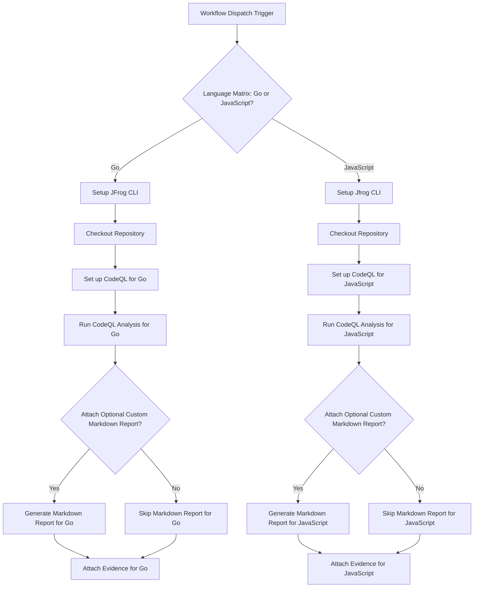

# CodeQL Security Analysis Evidence Example
This repository provides a working example of a GitHub Actions workflow that automates Static Application Security Testing (SAST) using GitHub CodeQL. It runs parallel jobs for different languages (Go and JavaScript), builds the respective packages, and attaches the CodeQL scan results as signed, verifiable evidence to each package in JFrog Artifactory.

This workflow is a critical pattern for "shifting left," embedding security scanning directly into your CI pipeline and creating an immutable, auditable record of your code's security posture.

##  Overview
The workflow performs CodeQL analysis on Go and JavaScript codebases, publishes the packages to Artifactory, and attaches the CodeQL analysis results as evidence. This enables traceability and security compliance in your CI/CD pipeline.

## Prerequisites
- JFrog CLI 2.76.1 or above (installed automatically in the workflow)
- Go 1.24.3 (for Go analysis)
- Node.js 18.x (for JavaScript analysis)
- The following GitHub repository variables:
    - `ARTIFACTORY_URL` (Artifactory base URL)
- The following GitHub repository secrets:
    - `ARTIFACTORY_ACCESS_TOKEN` (Artifactory access token)
    - `JFROG_SIGNING_KEY`
 
## **Key Features**

* **Parallel Language Analysis**: Uses a GitHub Actions matrix strategy to efficiently run builds and scans for Go and JavaScript simultaneously.  
* **Automated SAST**: Leverages the `github/codeql-action` to perform deep static analysis and identify security vulnerabilities.  
* **SARIF Output**: Generates industry-standard Static Analysis Results Interchange Format (SARIF) files for the scan results.  
* **Optional Markdown Report**: Includes a helper script to convert the detailed SARIF file into a human-readable Markdown summary.  
* **Signed Evidence Attachment**: Attaches the SARIF scan results as a predicate to the corresponding Go and JavaScript packages in Artifactory, cryptographically signing the evidence for integrity.

## Supported Languages
- Go
- JavaScript

## Workflow


## Environment Setup

### Go Package Configuration
```yaml
jf go-config --repo-resolve=go-remote --repo-deploy=go-local \
  --server-id-deploy=setup-jfrog-cli-server \
  --server-id-resolve=setup-jfrog-cli-server
```

### JavaScript Package Configuration
```yaml
jf npm-config --repo-resolve=javascript-remote --repo-deploy=javascript-local \
  --server-id-deploy=setup-jfrog-cli-server \
  --server-id-resolve=setup-jfrog-cli-server
```

## Evidence Attachment
The workflow attaches CodeQL analysis results as evidence using the following format:

### For Go Packages:
```yaml
jf evd create \
--package-name "jfrog.com/mygobuild" \
--package-version $PACKAGE_VERSION \
--package-repo-name go-local \
--key "${{ secrets.CODEQL_SIGNING_KEY }}" \
--key-alias ${{ vars.CODEQL_KEY_ALIAS }} \
--predicate "results-go/go.sarif" \
--predicate-type "http://github.com/CodeQL/static-analysis" \
--markdown "results-go/go-report.md"
```

### For JavaScript Packages:
```yaml
jf evd create \
--package-name my-javascript-build \
--package-version $PACKAGE_VERSION \
--package-repo-name javascript-local \
--key "${{ secrets.CODEQL_SIGNING_KEY }}" \
--key-alias ${{ vars.CODEQL_KEY_ALIAS }} \
--predicate "results-javascript/javascript.sarif" \
--predicate-type "http://github.com/CodeQL/static-analysis" \
--markdown "results-javascript/javascript-report.md"
```


### **How It Works: A Step-by-Step Breakdown **

This workflow is defined in the `codeql-evidence.yml` file and performs the following key actions for both Go and JavaScript in parallel.

1. **Build and Publish Package**: The workflow first checks out the relevant code (`go` or `js`). It then uses the JFrog CLI to configure the appropriate package manager (`go` or `npm`) to resolve and deploy artifacts through Artifactory. Finally, it builds and publishes the package, associating it with build information in Artifactory.  
2. **Run CodeQL Analysis**:  
   * **Initialization**: The `github/codeql-action/init` step prepares the environment for scanning by downloading the CodeQL engine and specifying which language and query suites to use.  
   * **Analysis**: The `github/codeql-action/analyze` step performs the actual scan on the code. It generates a detailed `*.sarif` file containing any findings. The `upload: false` parameter is set because we will attach the SARIF file to Artifactory ourselves.  
3. **Generate Optional Markdown Report**: If the `ATTACH_OPTIONAL_CUSTOM_MARKDOWN_TO_EVIDENCE` environment variable is `true`, a Python helper script (`sarif_to_markdown.py`) is run. This script parses the complex SARIF file and generates a simple, human-readable Markdown report summarizing the findings.  
4. **Attach Signed Evidence**: This is the final and most critical step. The `jf evd create` command is used to attach the evidence to the specific package version that was published earlier.  
   * The `--predicate` flag points to the official `*.sarif` file, which serves as the machine-readable evidence.  
   * The optional `--markdown` flag attaches the custom-generated Markdown report for easy viewing in the Artifactory UI.  
   * The evidence is cryptographically signed using your `PRIVATE_KEY`, ensuring its authenticity and integrity.

## Workflow Trigger
The analysis is triggered on:
- Push to main branch
- Manual workflow dispatch

## References
- [CodeQL Documentation](https://codeql.github.com/docs/)
- [JFrog CLI Documentation](https://www.jfrog.com/confluence/display/CLI/CLI+for+JFrog+Artifactory)
- [GitHub CodeQL Action](https://github.com/github/codeql-action)
- [JFrog Evidence Management](https://www.jfrog.com/confluence/display/JFROG/Evidence+Management)


