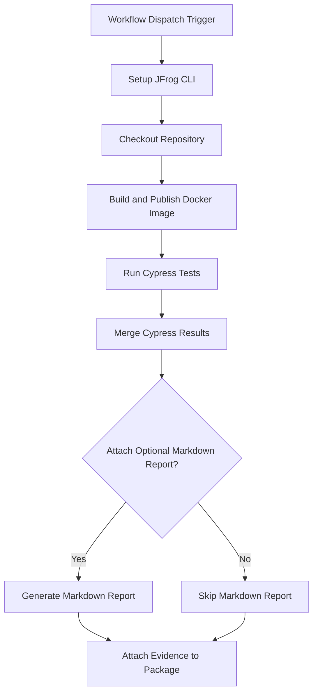

# Cypress Test Reports Evidence Example

This repository provides a working example of a GitHub Actions workflow that builds a Docker image, runs a full suite of Cypress end-to-end (E2E) tests against the running application, and attaches the test results as signed, verifiable evidence to the image in JFrog Artifactory.

This workflow creates a powerful, automated quality gate, ensuring that every build has a tamper-proof record of its test outcomes directly linked to it.

## Overview

The workflow builds a Docker image, runs Cypress tests, generates test result evidence (JSON and Markdown), pushes the image to Artifactory, and attaches the signed Cypress test results as evidence to the image package. This enables traceability and compliance for testing in your CI/CD pipeline.

### **Key Features**

* **Build & Test**: Automatically builds a Docker image from a `Dockerfile`.  
* **Live E2E Testing**: Uses the `cypress-io/github-action` to install dependencies, start the application, and run a full suite of Cypress tests against it.  
* **Consolidated Reporting**: Merges test results from multiple spec files into a single, unified JSON report.  
* **Optional Markdown Summary**: Includes a script to generate a human-readable Markdown report from the JSON test results.  
* **Signed Evidence Attachment**: Attaches the JSON test report as a predicate to the corresponding Docker image in Artifactory, cryptographically signing it for integrity.

## Prerequisites

- JFrog CLI 2.65.0 or above (installed automatically in the workflow)
- Artifactory configured as a Docker registry
- The following GitHub repository variables:
    - `JF_URL` (Artifactory Docker registry domain, e.g. `mycompany.jfrog.io`)
    - `ARTIFACTORY_URL` (Artifactory base URL)
- The following GitHub repository secrets:
    - `JF_ACCESS_TOKEN` (Artifactory access token)
    - `CYPRESS_RECORD_KEY` (Cypress dashboard record key)
    - `PRIVATE_KEY` (Private key for signing evidence)
    - `PRIVATE_KEY_ALIAS` (Key alias for signing evidence)

## Environment Variables Used

- `REGISTRY_URL` - Docker registry domain (from `JF_URL`)
- `REPO_NAME` - Docker repository name
- `IMAGE_NAME` - Docker image name
- `TAG_NAME` - Docker image tag (uses GitHub run number)
- `BUILD_NAME` - Build name for Artifactory
- `BUILD_NUMBER` - Build number (uses GitHub run number)
- `ATTACH_OPTIONAL_MARKDOWN_TO_EVIDENCE` - Set to `true` to attach a Markdown report as evidence
- `UPLOAD_CYPRESS_REPORT_TO_CLOUD` - Set to `true` to record Cypress results to the Cypress Dashboard

## Workflow


## Example Usage

You can trigger the workflow manually from the GitHub Actions tab. The workflow will:

- Build and test the Docker image
- Run Cypress Tests
- Push the image to Artifactory
- Attach the Cypress test results as evidence

## Key Commands Used

- **Build and Push Docker Image:**
  The workflow first builds the Docker image and pushes it to your Artifactory instance. It then uses jf rt build-publish to create a comprehensive Build Info record for the process.
  
  ```bash
  docker build . --file ./examples/cypress/Dockerfile --tag $REGISTRY_URL/$REPO_NAME/$IMAGE_NAME:$TAG_NAME
  jf rt docker-push $REGISTRY_URL/$REPO_NAME/$IMAGE_NAME:$TAG_NAME $REPO_NAME --build-name=$BUILD_NAME --build-number=$BUILD_NUMBER
  jf rt build-publish $BUILD_NAME $BUILD_NUMBER
  ```
- **Run Cypress Tests:**
This is the core testing step. The `cypress-io/github-action` automates the entire process of installing dependencies, starting the application, and running the E2E tests against it. Note that this step uses `continue-on-error: true`, meaning the workflow will proceed to the evidence attachment step even if some tests fail, ensuring a record of the failure is still captured.
  
  ```yaml
  uses: cypress-io/github-action@v6
  with:
    record: ${{ env.UPLOAD_CYPRESS_REPORT_TO_CLOUD == 'true' }}
    install: true
    install-command: npm install
    start: npm run start
    quiet: true
    wait-on: 'http://localhost:3000/app.html'
    wait-on-timeout: 120
  env:
    CYPRESS_RECORD_KEY: ${{ secrets.CYPRESS_RECORD_KEY }}
  continue-on-error: true
  ```
  Cypress runs tests in parallel and generates multiple report files. These steps use `npm` scripts to first merge them into a single, unified `overall-report.json`, and then optionally generate a human-readable Markdown report.
  
- **Attach Evidence:**
This final step uses `jf evd create` to attach the test results to the Docker image that was built at the start. The unified JSON report serves as the official, machine-readable predicate, while the optional Markdown report provides a summary for easy viewing in the Artifactory UI.

  ```bash
    jf evd create \
    --package-name $IMAGE_NAME \
    --package-version $TAG_NAME \
    --package-repo-name $REPO_NAME \
    --key "${{ secrets.PRIVATE_KEY }}" \
    --key-alias "${{ secrets.PRIVATE_KEY_ALIAS }}" \
    --predicate "reports/overall-report.json" \
    --predicate-type "http://cypress.io/test-results/v1" \
    [--markdown "reports/cypress-results.md"]
  ```
    The --markdown flag is included only if ATTACH_OPTIONAL_MARKDOWN_TO_EVIDENCE is set to true.
  
## References

- [Cypress Documentation](https://docs.cypress.io/)
- [JFrog Evidence Management](https://jfrog.com/help/r/jfrog-artifactory-documentation/evidence-management)
- [JFrog CLI Documentation](https://jfrog.com/getcli/)
