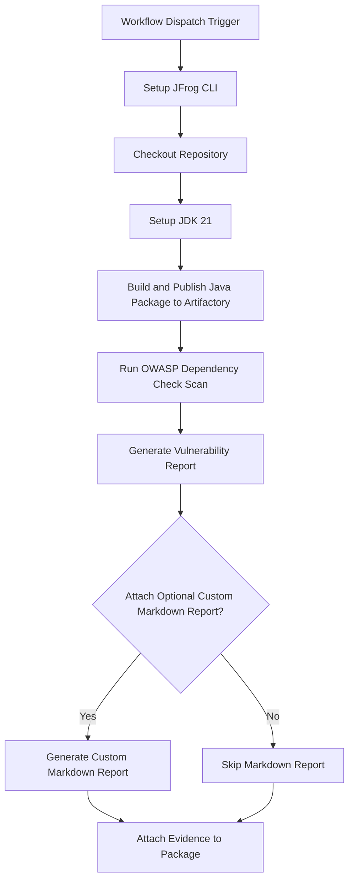

# **OWASP Dependency Check Evidence Example**

This repository provides a working example of a GitHub Actions workflow that automates Java Maven project security scanning using **OWASP Dependency Check**. It then attaches the resulting vulnerability report as signed, verifiable evidence to the package in **JFrog Artifactory**.

This workflow is an essential pattern for DevSecOps, creating a traceable, compliant, and secure software supply chain with comprehensive security vulnerability assessment.

### **Key Features**

* **Automated Build & Deploy**: Builds a Java Maven project and deploys it to Artifactory.
* **OWASP Dependency Check**: Runs comprehensive security vulnerability scanning using OWASP Dependency Check.
* **Vulnerability Report Generation**: Generates detailed JSON vulnerability reports with CVSS scoring.
* **Optional Markdown Report**: Includes a helper script to generate a human-readable Markdown summary from the Dependency Check JSON results.
* **Signed Evidence Attachment**: Attaches the vulnerability scan results to the corresponding package version in Artifactory using jf evd create, cryptographically signing it for integrity.
* **OWASP Dependency Check**: [OWASP Dependency Check](https://owasp.org/www-project-dependency-check/) security vulnerability scanner

### **Workflow**

The following diagram illustrates the sequence of operations performed by the GitHub Actions workflow.



---

### **1. Prerequisites**

Before running this workflow, you must have:

* JFrog CLI 2.65.0 or above (installed automatically in the workflow)
* An Artifactory repository of type maven (e.g., maven-depcheck-local).
* A private key and a corresponding key alias configured in your JFrog Platform for signing evidence.
* The following GitHub repository variables:
  * `JF_URL` (Artifactory base URL, e.g. `https://mycompany.jfrog.io`)
  * `EVIDENCE_KEY_ALIAS` (Key alias for signing evidence)
* The following GitHub repository secrets:
  * `ARTIFACTORY_ACCESS_TOKEN` (Artifactory access token)
  * `PRIVATE_KEY` (Private key for signing evidence)

### Environment Variables Used

* `REGISTRY_DOMAIN` - Maven registry domain
* `REPO_NAME` - Maven repository name
* `PACKAGE_NAME` - Maven artifact name
* `VERSION` - Build version (uses GitHub run number)
* `BUILD_NAME` - Build information name in Artifactory
* `ATTACH_OPTIONAL_CUSTOM_MARKDOWN_TO_EVIDENCE` - Controls markdown report generation

### **2. Configuration**

To use this workflow, you must configure the following GitHub Repository Secrets and Variables.

#### **GitHub Secrets**

Navigate to Settings > Secrets and variables > Actions and create the following secrets:

| Secret Name | Description |
| :---- | :---- |
| ARTIFACTORY_ACCESS_TOKEN | A valid JFrog Access Token with permissions to read, write, and annotate in your target repository. |
| PRIVATE_KEY | The private key used to sign the evidence. This key corresponds to the alias configured in JFrog Platform. |

#### **GitHub Variables**

Navigate to Settings > Secrets and variables > Actions and create the following variables:

| Variable Name | Description | Example Value |
| :---- | :---- | :---- |
| JF_URL | The base URL of your JFrog Platform instance. | https://mycompany.jfrog.io |
| EVIDENCE_KEY_ALIAS | The alias for the public key in JFrog Platform used to verify the evidence signature. | my-signing-key-alias |

#### **Workflow Environment Variables**

You can also customize the workflow's behavior by modifying the env block in the .github/workflows/owasp-depcheck-evidence-example.yml file:

| Variable Name | Description | Default Value |
| :---- | :---- | :---- |
| REPO_NAME | The name of the target Maven repository in Artifactory. | maven-depcheck-local |
| PACKAGE_NAME | The name of the Maven artifact to be built and deployed. | simple-java-depcheck |
| BUILD_NAME | The name assigned to the build information in Artifactory. | depcheck-maven-build |
| ATTACH_OPTIONAL_CUSTOM_MARKDOWN_TO_EVIDENCE | Set to true to generate and attach a Markdown report alongside the JSON evidence. Set to false to skip this step. | true |

---

### **3. Usage**

This workflow is triggered manually.

1. Navigate to the **Actions** tab of your forked repository.
2. In the left sidebar, click on the **Dependency Check with Evidence Integration** workflow.
3. Click the **Run workflow** dropdown button. You can leave the default branch selected.
4. Click the green **Run workflow** button.

## Repository Structure

```
examples/depcheck/
├── .github/workflows/
│   └── owasp-depcheck-evidence-example.yml  # Main workflow with evidence integration
├── examples/depcheck/
│   ├── src/                           # Java Maven project
│   │   ├── main/java/com/example/     # Source code
│   │   └── pom.xml                    # Maven configuration
│   └── scripts/
│       └── markdown-converter.py      # Evidence report converter
└── README.md                          # This file
```

## Workflow Overview

The GitHub Actions workflow (`owasp-depcheck-evidence-example.yml`) performs the following steps:

### 1. **Build and Package**
- Sets up Java 21 environment
- Builds the Maven project
- Deploys artifacts to JFrog Artifactory

### 2. **Security Scanning**
- Runs OWASP Dependency Check on built artifacts
- Scans for known vulnerabilities in dependencies
- Generates JSON vulnerability reports

### 3. **Evidence Generation**
- Converts JSON reports to readable markdown format (optional)
- Creates evidence reports suitable for attachment to packages
- Provides comprehensive vulnerability analysis

### 4. **Evidence Attachment**
- Publishes build information to JFrog Artifactory
- Attaches signed evidence to builds in JFrog Artifactory
- Uses cryptographic signing for evidence integrity
- Creates verifiable security attestation

## Evidence Integration

This project follows the evidence management pattern from [JFrog Evidence Examples](https://github.com/jfrog/Evidence-Examples), where:

- **Security scan results** become verifiable evidence
- **Markdown reports** provide human-readable evidence
- **Evidence is attached** to packages for security attestation
- **Signed evidence** ensures integrity and authenticity

## Local Development

For local development and testing:

```bash
# Build the project locally
cd examples/depcheck/src
mvn clean compile package

# Run dependency check (requires OWASP Dependency Check CLI)
dependency-check --scan target/ --format JSON --out reports/

# Convert to markdown evidence
python ../scripts/markdown-converter.py reports/dependency-check-report.json
```

## Dependency Check Configuration

The workflow configures OWASP Dependency Check with:

- **Project Name**: Uses the package name for consistency
- **Output Format**: JSON for processing, optional Markdown for evidence
- **Scan Path**: Maven target directory (`examples/depcheck/src/target`)
- **No Updates**: Uses cached vulnerability database (`--noupdate`)
- **Evidence Type**: `https://owasp.org/dependency-check` predicate type
- **Evidence Attachment**: Attaches evidence to build information in Artifactory

## Evidence Management

### Attaching Evidence to Builds

This workflow follows the JFrog Evidence Examples pattern by attaching evidence to builds:

1. **Build Evidence** - Security scan results attached to build information in Artifactory
2. **Build Publishing** - Build information is published to Artifactory for evidence attachment
3. **Signed Evidence** - Cryptographically signed vulnerability reports
4. **Verifiable Evidence** - Evidence that can be verified using the configured key alias

### Evidence Types Generated

- **Dependency Check JSON Report** - Raw vulnerability data in JSON format
- **Markdown Evidence Report** - Human-readable security summary (optional)
- **Build Evidence** - Evidence attached to build information in Artifactory
- **Signed Evidence** - Cryptographically signed evidence for integrity verification

## Security Considerations

- **CVSS Scoring**: Uses industry-standard Common Vulnerability Scoring System
- **Vulnerability Assessment**: Comprehensive scanning of dependencies for known vulnerabilities
- **Evidence Integrity**: Generated evidence is cryptographically signed for authenticity
- **Audit Trail**: Complete record of security assessments with verifiable evidence
- **CVE References**: Direct links to vulnerability databases for detailed information

## Contributing

This project follows the evidence management patterns established by JFrog Evidence Examples. Contributions should:

1. Maintain evidence integrity and verifiability
2. Follow the established workflow patterns for security scanning
3. Ensure vulnerability scan results are properly formatted
4. Include appropriate documentation for evidence types
5. Maintain consistency with the OWASP Dependency Check integration

## References

- [JFrog Evidence Examples](https://github.com/jfrog/Evidence-Examples) - Original inspiration and patterns
- [OWASP Dependency Check](https://owasp.org/www-project-dependency-check/) - Vulnerability scanning tool
- [JFrog Evidence Management](https://jfrog.com/help/r/jfrog-artifactory-documentation/evidence-management-overview) - Evidence management documentation
- [CVSS Scoring System](https://www.first.org/cvss/) - Vulnerability severity scoring 