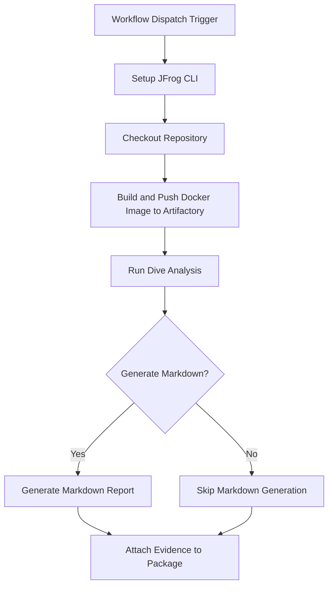

# **Dive Image Analysis Evidence Example**

This repository provides a working example of a GitHub Actions workflow that automates Docker image analysis using Dive. It then attaches the resulting layer analysis report as signed, verifiable evidence to the package in JFrog Artifactory.

This workflow helps you "shift left" on container optimization by providing a clear, auditable record of your image's efficiency,

### **Key Features**

* **Automated Build & Push**: Builds a Docker image from a Dockerfile.  
* **Image Analysis**: Uses Dive to analyze the image for inefficiencies.  
* **Evidence Generation**: Creates a dive.json predicate file.  
* **Optional Markdown Report**: Includes a helper script to generate a human-readable Markdown summary from the Dive JSON results.  
* **Signed Evidence Attachment**: Attaches the analysis results to the corresponding package version in Artifactory using jf evd create, cryptographically signing it for integrity.

### **Workflow**

The following diagram illustrates the sequence of operations performed by the GitHub Actions workflow.



---

### **1\. Prerequisites**

Before running this workflow, you must have:

* JFrog CLI 2.65.0 or above (installed automatically in the workflow)  
* An Artifactory repository of type docker (e.g., docker-dive-repo).  
* A private key and a corresponding key alias configured in your JFrog Platform for signing evidence.  
* The following GitHub repository variables:  
  * `REGISTRY_DOMAIN` (Artifactory Docker registry domain, e.g. `mycompany.jfrog.io`)  
  * `EVIDENCE_KEY_ALIAS` (Key alias for signing evidence)  
* The following GitHub repository secrets:  
  * `ARTIFACTORY_ACCESS_TOKEN` (Artifactory access token)  
  * `PRIVATE_KEY` (Private key for signing evidence)

### Environment Variables Used

* `REGISTRY_DOMAIN` \- Docker registry domain

### **2\. Configuration**

To use this workflow, you must configure the following GitHub Repository Secrets and Variables.

#### **GitHub Secrets**

Navigate to Settings \> Secrets and variables \> Actions and create the following secrets:

| Secret Name | Description |
| :---- | :---- |
| ARTIFACTORY_ACCESS_TOKEN | A valid JFrog Access Token with permissions to read, write, and annotate in your target repository. |
| PRIVATE_KEY | The private key used to sign the evidence. This key corresponds to the alias configured in JFrog Platform. |

#### **GitHub Variables**

Navigate to Settings \> Secrets and variables \> Actions and create the following variables:

| Variable Name | Description | Example Value |
| :---- | :---- | :---- |
| JF_URL | The base URL of your JFrog Platform instance. | https://mycompany.jfrog.io |
| EVIDENCE_KEY_ALIAS | The alias for the public key in JFrog Platform used to verify the evidence signature. | my-signing-key-alias |

#### **Workflow Environment Variables**

You can also customize the workflow's behavior by modifying the env block in the .github/workflows/dive-evidence-example.yml file:

| Variable Name | Description | Default Value |
| :---- | :---- | :---- |
| DOCKERFILE_PATH | The path to the Dockerfile in your repository. | ./Dockerfile |
| IMAGE_NAME | The name of the Docker image to be built. | my-dive-image |
| IMAGE_TAG | The tag for the Docker image. | latest |
| REGISTRY_REPO | The Artifactory repository to which the image will be pushed. | docker-dive-repo |
| DIVE_OPTIONS | Additional options for the Dive command. | --ignore-unpackaged |

---

### **3\. Usage**

This workflow is triggered manually.

1. Navigate to the **Actions** tab of your forked repository.  
2. In the left sidebar, click on the **Dive evidence integration example** workflow.  
3. Click the **Run workflow** dropdown button. You can leave the default branch selected.  
4. Click the green **Run workflow** button.

Once the workflow completes successfully, you can navigate to your repository in Artifactory (docker-dive-repo) and view the docker-dive-image. Under the **Evidence** tab for the latest version, you will find the signed Dive analysis results.

---

### **How It Works: A Step-by-Step Breakdown**

1. **Setup and Checkout**: The workflow begins by setting up the JFrog CLI and checking out the repository code.  
2. **Build and Publish Docker Image**: It uses standard docker commands to build an image. The `jf rt docker-push` command then pushes this image to your Artifactory instance and associates it with build information using `jf rt build-publish`.  
3. **Run Dive Analysis**: The Dive tool is executed against the newly pushed image. It analyzes the image for inefficiencies and outputs the findings into a structured `dive.json` file.  
4. **Generate Optional Markdown Report**: If `ATTACH_OPTIONAL_CUSTOM_MARKDOWN_TO_EVIDENCE` is true, a Python helper script is run to parse the JSON output and create a more human-readable `dive-analysis.md` file.  
5. **Attach Signed Evidence**: The final step uses the `jf evd create` command. It takes the `dive.json` file as the official "predicate" and attaches it as evidence to the specific package version in Artifactory. The evidence is signed using the provided `PRIVATE_KEY`, ensuring its authenticity and integrity.

---

### **Key Commands Used**

* **Build Docker Image:**
  The workflow first builds a Docker image from the specified `Dockerfile` and pushes it to your Artifactory instance using standard `docker` and `jf rt` commands.

```
docker build . --file ./examples/dive/Dockerfile --tag $REGISTRY_DOMAIN/$REPO_NAME/$IMAGE_NAME:$VERSION
```

* **Run Dive Analysis:**
  This step runs the `wagoodman/dive` tool as a Docker container to analyze the image that was just pushed. It mounts the host's Docker socket to access the image and binds the current directory to get the JSON report out of the container.

```
docker run -it --rm -e CI=true \
  -v /var/run/docker.sock:/var/run/docker.sock \
  -v $(pwd):/output docker.io/wagoodman/dive \
  $REGISTRY_DOMAIN/$REPO_NAME/$IMAGE_NAME:$VERSION \
  --json /output/dive.json
```

* **Push Docker Image:**

```
jf rt docker-push $REGISTRY_DOMAIN/$REPO_NAME/$IMAGE_NAME:$VERSION $REPO_NAME --build-name=$BUILD_NAME --build-number=${{ github.run_number }}
```

* **Attach Evidence:**
  This final step uses `jf evd create` to attach the Dive analysis to the Docker image built earlier. The `dive.json` file serves as the official, machine-readable predicate, while the optional Markdown report provides a summary for easy viewing in the Artifactory UI.

```
jf evd create \
  --package-name $IMAGE_NAME \
  --package-version $VERSION \
  --package-repo-name $REPO_NAME \
  --key "${{ secrets.PRIVATE_KEY }}" \
  --key-alias "${{ vars.EVIDENCE_KEY_ALIAS }}" \
  --predicate ./dive.json \
  --predicate-type dive/docker-size-scan/v1
```

### **References**

* [Dive Documentation](https://github.com/wagoodman/dive)  
* [JFrog Evidence Management](https://jfrog.com/help/r/jfrog-artifactory-documentation/evidence-management)  
* [JFrog CLI Documentation](https://jfrog.com/getcli/)
