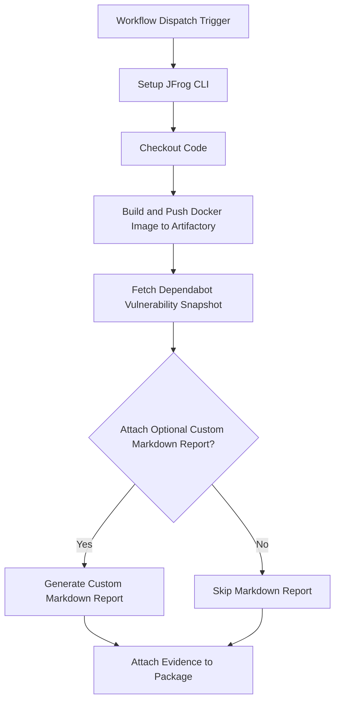

# Dependabot Vulnerability Alerts Evidence Example Workflow

This repository provides a working example of a GitHub Actions workflow that captures all open Dependabot vulnerability alerts for a repository and attaches them as signed, verifiable evidence to a Docker image in JFrog Artifactory.

This workflow creates a point-in-time snapshot of your repository's dependency security posture,

## Overview
The workflow builds a Docker image, fetches open Dependabot vulnerability alerts for the repository, pushes the Docker image to JFrog Artifactory, and attaches the Dependabot alerts as signed evidence to the Docker image package. This workflow's primary goal is to automate the collection of security scan results from Dependabot and associate them directly with the deployed artifact in Artifactory, enhancing traceability and compliance for security posture in your CI/CD pipeline.

### **Key Features**

* **Build & Publish**: Builds a Docker image from a `Dockerfile` to serve as the subject for the evidence.  
* **Vulnerability Data Fetching**: Uses the `gh` CLI to query the GitHub API for all open Dependabot alerts.  
* **JSON Transformation**: Leverages `jq` to transform the raw API response into a clean, structured JSON predicate.  
* **Optional Markdown Summary**: Includes a helper script to generate a human-readable Markdown report from the JSON data.  
* **Signed Evidence Attachment**: Attaches the JSON report as a predicate to the co

## Prerequisites
- JFrog CLI 2.65.0 or above (installed automatically in the workflow)
- Artifactory configured as a Docker registry
- GitHub repository variables: Configure the following variables in your GitHub repository settings
  (Settings > Secrets and variables > Actions > Variables) 
  - `REGISTRY_DOMAIN` (Artifactory Docker registry domain, e.g. `mycompany.jfrog.io`)
  - `ARTIFACTORY_URL` (Artifactory base URL)
  - `TEST_PUB_KEY_ALIAS` (Key alias for verifying evidence)
- GitHub repository secrets: Configure the following secrets in your GitHub repository settings 
  (Settings > Secrets and variables > Actions > Repository secrets)
  - `ARTIFACTORY_ACCESS_TOKEN` (Artifactory access token)
  - `JF_USER` (Artifactory username)
  - `TEST_PRVT_KEY` (Private key for signing evidence)
  - `TOKEN_GIT` (A GitHub Token with "security_events: read" permission to access Dependabot alerts via the GitHub API)

## Environment Variables Used
- `REGISTRY_DOMAIN` - Docker registry domain
- `REPO_NAME` - Docker repository name 
- `IMAGE_NAME` - Docker image name 
- `VERSION` - Image version
- `BUILD_NAME` - Name for the build info 

## Workflow



## Example Dependabot Vulnerability Alert Data

The Fetch Dependabot Vulnerability Snapshot step retrieves Dependabot alerts and transforms them into a structured JSON format.
- advisoryUrl: Link to the security advisory.
- cveId: Common Vulnerabilities and Exposures identifier (e.g., CVE-2020-1734).
- detectedAt: Timestamp when the vulnerability was detected.
- ecosystem: The package ecosystem (e.g., pip).
- ghsaId: GitHub Security Advisory ID (e.g., GHSA-h39q-95q5-9jfp).
- packageName: The name of the vulnerable package (e.g., ansible).
- patchedVersion: The version where the vulnerability is patched (e.g., 2.9.11, or N/A if not specified).
- severity: The severity level (e.g., high, medium, low).
- summary: A brief summary of the vulnerability.
- vulnerableVersionRange: The version range affected by the vulnerability.

## Key Commands Used

- **Build and Push Docker Image to Artifactory**
  The workflow first builds a Docker image and pushes it to your Artifactory instance. This image acts as the "subject" to which the Dependabot evidence will be attached.
  
  ```bash
    docker build -f ./examples/github/dependabot/Dockerfile . --tag $REGISTRY_DOMAIN/$REPO_NAME/$IMAGE_NAME:$VERSION
    jf rt docker-push $REGISTRY_DOMAIN/$REPO_NAME/$IMAGE_NAME:$VERSION $REPO_NAME --build-name=$BUILD_NAME --build-number=$VERSION
  ```
- **Fetch Dependabot Vulnerability Snapshot**
  This is the core logic of the workflow. It uses the `gh api` command to query your repository's open Dependabot alerts. The powerful `jq` command then parses the complex JSON response from the API, extracting and reformatting the key details into a clean `dependabot.json` file.rresponding Docker image in Artifactory, cryptographically signing it for integrity.
  
  ```bash
    gh api "repos/${OWNER}/${REPO}/dependabot/alerts?state=open" \
            --jq '[.[] |
                {
                packageName: .dependency.package.name,
                ecosystem: .dependency.package.ecosystem,
                vulnerableVersionRange: .security_vulnerability.vulnerable_version_range,
                patchedVersion: (try .security_vulnerability.first_patched_version.identifier // "N/A"),
                severity: .security_vulnerability.severity,
                ghsaId: .security_advisory.ghsa_id,
                cveId: (.security_advisory.cve_id // "N/A"),
                advisoryUrl: .html_url,
                summary: .security_advisory.summary,
                detectedAt: .created_at
                }
            ]' > result.json

    jq -n --argjson data "$(cat result.json)" '{ data: $data }' > dependabot.json
  ```

- **Attach Evidence:**
  This final step uses `jf evd create` to attach the Dependabot alert data to the Docker image. The `dependabot.json` file serves as the official, machine-readable predicate, while the optional Markdown report provides a summary for easy viewing in the Artifactory UI.
  
  ```bash
  jf evd create \
            --package-name $IMAGE_NAME \
            --package-version $VERSION \
            --package-repo-name $REPO_NAME \
            --key "${{ secrets.TEST_PRVT_KEY }}" \
            --key-alias ${{ vars.TEST_PUB_KEY_ALIAS }} \
            --provider-id "github" \
            --predicate ./dependabot.json \
            --predicate-type http://Github.com/Dependabot/static-analysis
  ```

## References
- [Dependabot Documentation](https://docs.github.com/en/rest/dependabot)
- [JFrog Evidence Management](https://jfrog.com/help/r/jfrog-artifactory-documentation/evidence-management)
- [JFrog CLI Documentation](https://jfrog.com/getcli/)

