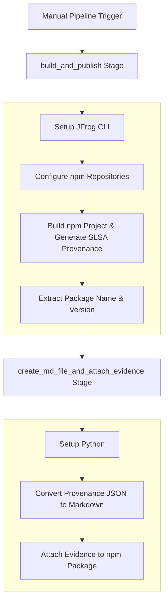

# **GitLab Provenance & SLSA Evidence Example**

This repository provides a working example of a GitLab CI/CD pipeline that builds an npm package, automatically generates SLSA-compliant provenance using GitLab's built-in features, and attaches this provenance as signed, verifiable evidence to the package in JFrog Artifactory.

This pipeline is a cornerstone of a secure software supply chain, creating a tamper-proof, auditable record that verifies how and where your software was built.

### **Key Features**

* **Automated Build & Push**: Builds an npm project and publishes artifacts to Artifactory.
* **SLSA Provenance Generation**: Uses GitLab Runner to automatically generate SLSA provenance metadata for the build artifacts.
* **Evidence Generation**: Creates an artifacts-metadata.json predicate file containing SLSA provenance.
* **Markdown Report**: Includes a helper script to generate a human-readable Markdown summary from the SLSA JSON results.
* **Signed Evidence Attachment**: Attaches the provenance results to the corresponding npm package version in Artifactory using jf evd create, cryptographically signing it for integrity.
* **SLSA**: [SLSA Provenance Specification](https://slsa.dev/spec/v1.1/provenance)

### **Workflow**

The following diagram illustrates the sequence of operations performed by the GitLab CI/CD pipeline.



---

### **1. Prerequisites**

Before running this pipeline, you must have:

* JFrog CLI 2.65.0 or above (installed automatically in the pipeline)
* An Artifactory repository of type npm (e.g., evidence-npm).
* A private key and a corresponding key alias configured in your JFrog Platform for signing evidence.
* The following GitLab CI/CD variables:
  * `ARTIFACTORY_URL` (Artifactory base URL, e.g. `https://mycompany.jfrog.io`)
  * `PRIVATE_KEY_ALIAS` (Key alias for signing evidence)
* The following GitLab CI/CD secrets:
  * `ARTIFACTORY_ACCESS_TOKEN` (Artifactory access token)
  * `PRIVATE_KEY` (Private key for signing evidence)

### Environment Variables Used

* `RUNNER_GENERATE_ARTIFACTS_METADATA` - Enables GitLab Runner to generate SLSA provenance metadata for the build artifacts.

### **2. Configuration**

To use this pipeline, you must configure the following GitLab CI/CD Variables.

#### **GitLab Variables**

Navigate to Settings > CI/CD > Variables and create the following variables:

| Variable Name | Description | Example Value | Protected | Masked |
| :---- | :---- | :---- | :---- | :---- |
| ARTIFACTORY_URL | The base URL of your JFrog Platform instance. | https://mycompany.jfrog.io | No | No |
| PRIVATE_KEY_ALIAS | The alias for the public key in JFrog Platform used to verify the evidence signature. | my-signing-key-alias | No | No |
| ARTIFACTORY_ACCESS_TOKEN | A valid JFrog Access Token with permissions to read, write, and annotate in your target repository. | - | Yes | Yes |
| PRIVATE_KEY | The private key used to sign the evidence. This key corresponds to the alias configured in JFrog Platform. | - | Yes | Yes |

#### **Pipeline Environment Variables**

You can also customize the pipeline's behavior by modifying the variables block in the .gitlab-ci.yml file:

| Variable Name | Description | Default Value |
| :---- | :---- | :---- |
| REPO_NAME | The name of the target npm repository in Artifactory. | evidence-npm |
| PREDICATE_FILE | Path to SLSA provenance JSON file. | ./artifacts-metadata.json |
| PREDICATE_TYPE | Predicate type URL for SLSA. | http://slsa.dev/provenance/v1 |
| MARKDOWN_FILE | Path to the generated Markdown file from provenance. | GitLabSLSA.md |

---

### **3. Usage**

This pipeline is triggered manually.

1. Navigate to the **CI/CD** tab of your GitLab repository.
2. In the left sidebar, click on **Pipelines**.
3. Click the **Run pipeline** button.
4. Select the branch you want to run the pipeline on (default is main).
5. Click the green **Run pipeline** button.

Once the pipeline completes successfully, you can navigate to your repository in Artifactory (evidence-npm) and view the npm artifact. Under the **Evidence** tab for the latest version, you will find the signed SLSA provenance results.

### **How It Works: A Step-by-Step Breakdown**

1. **build_and_publish Stage**: The pipeline begins by setting up the JFrog CLI, configuring npm repositories, and building the npm project using `jf npm publish` and `jf npm pack`.
2. **Extract Package Information**: The pipeline extracts the package name and version from the npm project using Node.js commands to read package.json.
3. **Generate SLSA Provenance**: GitLab Runner automatically generates SLSA provenance metadata for the build artifacts and outputs the findings into a structured artifacts-metadata.json file.
4. **create_md_file_and_attach_evidence Stage**: The second stage sets up JFrog CLI and Python, then converts the provenance JSON to a human-readable Markdown file using the `json-to-md.py` script.
5. **Attach Signed Evidence**: The final step uses the `jf evd create` command to attach both the JSON provenance and Markdown report as evidence to the specific npm package version in Artifactory. The evidence is signed using the provided PRIVATE_KEY, ensuring its authenticity and integrity.

### **Key Commands Used**

* **Configure JFrog CLI:**
```bash
jf config add --url ${ARTIFACTORY_URL} --access-token ${ARTIFACTORY_ACCESS_TOKEN} --interactive=false
```

* **Configure npm Repositories:**
```bash
jf npmc --repo-resolve evidence-npm --repo-deploy evidence-npm
```

* **Build and Publish npm Artifact:**
```bash
jf npm publish
jf npm pack
```

* **Extract npm Coordinates:**
```bash
node -p "require('./package.json').name"
node -p "require('./package.json').version"
```

* **Convert Provenance JSON to Markdown:**
```bash
python3 json-to-md.py
```

* **Attach Evidence:**
  The final step uses `jf evd create` to attach the extracted `predicate.json` to the npm package that was published in the first stage. This creates a permanent, tamper-proof attestation of the package's build provenance.
```bash
jf evd create \
  --package-name "${PACKAGE_NAME}" \
  --package-version "${PACKAGE_VERSION}" \
  --package-repo-name "${REPO_NAME}" \
  --key "${PRIVATE_KEY}" \
  --key-alias "${PRIVATE_KEY_ALIAS}" \
  --predicate "${PREDICATE_FILE}" \
  --predicate-type "${PREDICATE_TYPE}" \
  --provider-id="gitlab" \
  --markdown "${MARKDOWN_FILE}"
```

### **Limitation**

**Note:** The current pipeline and evidence attachment process expects a single npm artifact (tgz) is produced per build. It does **not** support multiple subjects or multiple packages in a single pipeline execution. This is a known limitation and should be considered when working with this example.

### **References**

* [SLSA Provenance](https://slsa.dev/spec/v1.1/provenance)
* [GitLab SLSA Provenance Generation](https://docs.gitlab.com/ci/pipeline_security/#slsa-provenance-generation)
* [JFrog Evidence Management](https://jfrog.com/help/r/jfrog-artifactory-documentation/evidence-management)
* [JFrog CLI Documentation](https://jfrog.com/getcli/)
