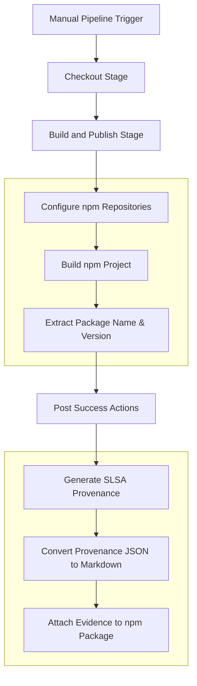

# Jenkins SLSA Evidence Example

This repository provides a working example of a Jenkins Pipeline that builds an npm package, automatically generates SLSA-compliant provenance, and attaches this provenance as signed, verifiable evidence to the package in JFrog Artifactory.

This pipeline is a cornerstone of a secure software supply chain, creating a tamper-proof, auditable record that verifies how and where your software was built, all within your Jenkins ecosystem.

### **Key Features**

* **Automated npm Build**: Builds and publishes an npm package to Artifactory using the JFrog CLI.  
* **SLSA Provenance Generation**: Leverages the **Jenkins SLSA Plugin** to automatically generate SLSA-compliant provenance metadata for the build.  
* **Optional Markdown Summary**: Includes a helper script to generate a human-readable Markdown report from the provenance data.  
* **Signed Evidence Attachment**: Attaches the SLSA provenance predicate to the corresponding npm package in Artifactory, cryptographically signing it for integrity.

## Overview

The pipeline builds an npm project, generates SLSA provenance, converts the provenance JSON to Markdown, publishes the artifact to Artifactory, and attaches the signed provenance as evidence to the npm package. This enables traceability and compliance for your Node.js artifacts in CI/CD.

### **Workflow**

The following diagram illustrates the sequence of operations performed by the Jenkins pipeline.



---

## Prerequisites

- JFrog CLI (installed via Jenkins tools)
- Artifactory configured as an npm repository
- JFrog CLI configured in Jenkins system settings with Artifactory access token
- The following Jenkins credentials:
    - `PRIVATE_PEM` (Private key for signing evidence)
    - `KEY_ALIAS` (Key alias for signing evidence)
    - `github` (GitHub credentials for source checkout if required)

**Note:** The Artifactory access token should be configured in Jenkins system settings for the JFrog CLI tool. This follows the recommended approach for using JFrog CLI in Jenkins as documented in the [JFrog Plugin documentation](https://jfrog.com/help/r/artifactory-how-to-use-jfrog-cli-in-jenkins-using-jfrog-plugin/artifactory-how-to-use-jfrog-cli-in-jenkins-using-jfrog-plugin).

## Environment Variables Used

- `PACKAGE_REPO_NAME` - npm repository name in Artifactory
- `PACKAGE_NAME` - npm package name (extracted from package.json)
- `PACKAGE_VERSION` - npm version (extracted from package.json)
- `PREDICATE_FILE_NAME` - Path to SLSA provenance JSON file
- `PREDICATE_TYPE` - Predicate type URL for SLSA
- `MARKDOWN_FILE_NAME` - Path to the generated Markdown file from provenance

## Pipeline Stages

1. **Checkout**
    - Clones the source code from GitHub.
2. **Build and Publish**
    - Configures npm repositories using JFrog Plugin.
    - Builds the npm project and publishes artifacts to Artifactory.
    - Extracts package name and version for evidence attachment.
3. **Provenance Generation and Evidence Attachment**
    - Generates SLSA provenance.
    - Converts the provenance JSON to Markdown.
    - Attaches the signed provenance (JSON and Markdown) as evidence to the npm package in Artifactory.

## Example Usage

Trigger the pipeline in Jenkins. The pipeline will:

- Build and publish the npm artifact
- Generate and convert the SLSA provenance
- Attach the provenance as evidence

## Key Commands Used

- **Configure npm Repositories:**
  ```bash
  jf npmc --repo-resolve evidence-npm --repo-deploy evidence-npm
  ```
- **Build and Publish npm Artifact:**
  ```bash
  jf npm publish
  jf npm pack
  ```
- **Extract npm Coordinates:**
  ```bash
  node -p "require('./package.json').name"
  node -p "require('./package.json').version"
  ```
- **Convert Provenance JSON to Markdown:**
  ```bash
  python3 json-to-md.py
  ```
- **Attach Evidence:**
  This crucial phase runs after the build is successful and handles the generation and attachment of the evidence.

   * **Generate SLSA Provenance**: The **Jenkins SLSA Plugin** automatically hooks into the build process. After the build completes, it generates an SLSA-compliant provenance file (e.g., `predicate.json`) attesting to the build's inputs, steps, and outputs.  
   * **Attach Signed Evidence**: The final step uses `jf evd create` to attach the generated provenance file to the npm package that was published earlier. This creates a permanent, tamper-proof link between the package and its build provenance.
  
  ```bash
  jf evd create --package-name="$PACKAGE_NAME" --package-version="$PACKAGE_VERSION" --package-repo-name="$PACKAGE_REPO_NAME" --key="$PRIVATE_PEM" --key-alias="$KEY_ALIAS" --predicate="$PREDICATE_FILE_NAME" --predicate-type="$PREDICATE_TYPE" --markdown="$MARKDOWN_FILE_NAME"
  ```

## Limitation

**Note:** The current pipeline and evidence attachment process expects a single npm artifact (tgz) is produced per build. It does **not** support multiple subjects or multiple packages in a single pipeline execution. This is a known limitation and should be considered when working with this example.

## References

- [SLSA Provenance](https://slsa.dev/spec/v1.1/provenance)
- [Jenkins SLSA Plugin](https://plugins.jenkins.io/slsa/)
- [JFrog Evidence Management](https://jfrog.com/help/r/jfrog-artifactory-documentation/evidence-management)
- [JFrog CLI Documentation](https://jfrog.com/getcli/)
- [How to use JFrog CLI in Jenkins using JFrog Plugin](https://jfrog.com/help/r/artifactory-how-to-use-jfrog-cli-in-jenkins-using-jfrog-plugin/artifactory-how-to-use-jfrog-cli-in-jenkins-using-jfrog-plugin)
