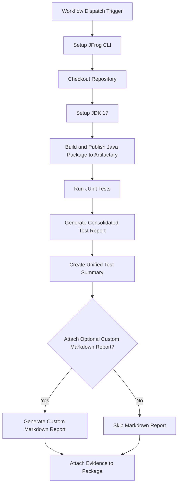

# **JUnit Test Evidence Example**

This repository provides a working example of a GitHub Actions workflow that automates Java Maven project testing using **JUnit**. It then attaches the resulting test report as signed, verifiable evidence to the package in **JFrog Artifactory**.

This workflow is an essential pattern for DevSecOps, creating a traceable, compliant, and secure software supply chain with comprehensive test coverage validation.

### **Key Features**

* **Automated Build & Deploy**: Builds a Java Maven project and deploys it to Artifactory.
* **JUnit Test Execution**: Runs comprehensive JUnit tests using Maven Surefire plugin.
* **Test Report Consolidation**: Merges multiple test reports into a single consolidated JSON format.
* **Optional Markdown Report**: Includes a helper script to generate a human-readable Markdown summary from the JUnit JSON results.
* **Signed Evidence Attachment**: Attaches the test results to the corresponding package version in Artifactory using jf evd create, cryptographically signing it for integrity.
* **JUnit**: [JUnit 5 testing framework](https://junit.org/junit5/)

### **Workflow**

The following diagram illustrates the sequence of operations performed by the GitHub Actions workflow.



---

### **1. Prerequisites**

Before running this workflow, you must have:

* JFrog CLI 2.65.0 or above (installed automatically in the workflow)
* An Artifactory repository of type maven (e.g., maven-junit-repo).
* A private key and a corresponding key alias configured in your JFrog Platform for signing evidence.
* The following GitHub repository variables:
  * `JF_URL` (Artifactory base URL, e.g. `https://mycompany.jfrog.io`)
  * `EVIDENCE_KEY_ALIAS` (Key alias for signing evidence)
* The following GitHub repository secrets:
  * `ARTIFACTORY_ACCESS_TOKEN` (Artifactory access token)
  * `PRIVATE_KEY` (Private key for signing evidence)

### Environment Variables Used

* `REGISTRY_DOMAIN` - Maven registry domain
* `REPO_NAME` - Maven repository name
* `PACKAGE_NAME` - Maven artifact name

### **2. Configuration**

To use this workflow, you must configure the following GitHub Repository Secrets and Variables.

#### **GitHub Secrets**

Navigate to Settings > Secrets and variables > Actions and create the following secrets:

| Secret Name | Description |
| :---- | :---- |
| ARTIFACTORY_ACCESS_TOKEN | A valid JFrog Access Token with permissions to read, write, and annotate in your target repository. |
| PRIVATE_KEY | The private key used to sign the evidence. This key corresponds to the alias configured in JFrog Platform. |

#### **GitHub Variables**

Navigate to Settings > Secrets and variables > Actions and create the following variables:

| Variable Name | Description | Example Value |
| :---- | :---- | :---- |
| JF_URL | The base URL of your JFrog Platform instance. | https://mycompany.jfrog.io |
| EVIDENCE_KEY_ALIAS | The alias for the public key in JFrog Platform used to verify the evidence signature. | my-signing-key-alias |

#### **Workflow Environment Variables**

You can also customize the workflow's behavior by modifying the env block in the .github/workflows/junit-evidence-example.yml file:

| Variable Name | Description | Default Value |
| :---- | :---- | :---- |
| REPO_NAME | The name of the target Maven repository in Artifactory. | maven-junit-repo |
| PACKAGE_NAME | The name of the Maven artifact to be built and deployed. | simple-java-maven |
| BUILD_NAME | The name assigned to the build information in Artifactory. | junit-maven-build |
| ATTACH_OPTIONAL_CUSTOM_MARKDOWN_TO_EVIDENCE | Set to true to generate and attach a Markdown report alongside the JSON evidence. Set to false to skip this step. | true |

---

### **3. Usage**

This workflow is triggered manually.

1. Navigate to the **Actions** tab of your forked repository.
2. In the left sidebar, click on the **JUnit evidence integration example** workflow.
3. Click the **Run workflow** dropdown button. You can leave the default branch selected.
4. Click the green **Run workflow** button.

Once the workflow completes successfully, you can navigate to your repository in Artifactory (maven-junit-repo) and view the simple-java-maven artifact. Under the **Evidence** tab for the latest version, you will find the signed JUnit test results.

### **How It Works: A Step-by-Step Breakdown**

1. **Setup and Checkout**: The workflow begins by setting up the JFrog CLI and checking out the repository code.
2. **Java Environment Setup**: Configures JDK 17 and caches Maven dependencies for optimal performance.
3. **Build and Deploy Maven Package**: Uses Maven to compile and deploy the Java package to Artifactory, associating it with build information.
4. **Run JUnit Tests**: Executes JUnit tests using Maven Surefire plugin, generating XML test reports.
5. **Generate Consolidated Test Report**: Runs Maven site generation and Surefire reporting to create comprehensive test documentation.
6. **Create Unified Test Summary**: Executes custom scripts to merge multiple test reports into a single consolidated JSON format.
7. **Generate Optional Markdown Report**: If ATTACH_OPTIONAL_CUSTOM_MARKDOWN_TO_EVIDENCE is true, a Python helper script parses the JSON output and creates a human-readable junit-results.md file.
8. **Attach Signed Evidence**: The final step uses the jf evd create command. It takes the consolidated-test-report.json file as the official "predicate" and attaches it as evidence to the specific package version in Artifactory. The evidence is signed using the provided PRIVATE_KEY, ensuring its authenticity and integrity.

### **Key Commands Used**

* **Build and Deploy Maven Package:**

```bash
cd examples/junit/src
mvn clean compile
mvn deploy -DaltDeploymentRepository=artifactory::default::$REGISTRY_DOMAIN/$REPO_NAME
```

* **Run JUnit Tests:**

```bash
cd examples/junit/src
mvn test
```

* **Generate Test Reports:**

```bash
cd examples/junit/src
mvn surefire-report:report-only
mvn site:site
```

* **Consolidate Test Results:**

```bash
cd examples/junit/src
./merge-test-reports.sh
./xml-to-json.sh
```

* **Generate Markdown Report:**

```bash
cd examples/junit/src
python ../junit_json_to_markdown_helper.py target/consolidated-test-report.json
```

* **Attach Evidence:**

```bash
jf evd create \
  --package-name $PACKAGE_NAME \
  --package-version $VERSION \
  --package-repo-name $REPO_NAME \
  --key "${{ secrets.PRIVATE_KEY }}" \
  --key-alias "${{ vars.EVIDENCE_KEY_ALIAS }}" \
  --predicate ./target/consolidated-test-report.json \
  --predicate-type http://junit.org/test-results \
  --markdown "junit-results.md"
```

### **Test Results Format**

The workflow generates a consolidated JSON test report with the following structure:

```json
{
  "testReport": {
    "summary": {
      "totalTests": 6,
      "totalFailures": 0,
      "totalErrors": 0,
      "totalSkipped": 0,
      "successRate": 100,
      "totalTime": "0.123",
      "timestamp": "2024-01-15T10:30:00Z"
    },
    "testSuites": [
      {
        "name": "testAddition",
        "class": "com.example.AdditionTest",
        "time": "0.045",
        "status": "passed"
      }
    ]
  }
}
```

### **References**

* [JUnit 5 Documentation](https://junit.org/junit5/docs/current/user-guide/)
* [Maven Surefire Plugin](https://maven.apache.org/surefire/maven-surefire-plugin/)
* [JFrog Evidence Management](https://jfrog.com/help/r/jfrog-artifactory-documentation/evidence-management)
* [JFrog CLI Documentation](https://jfrog.com/getcli/) 