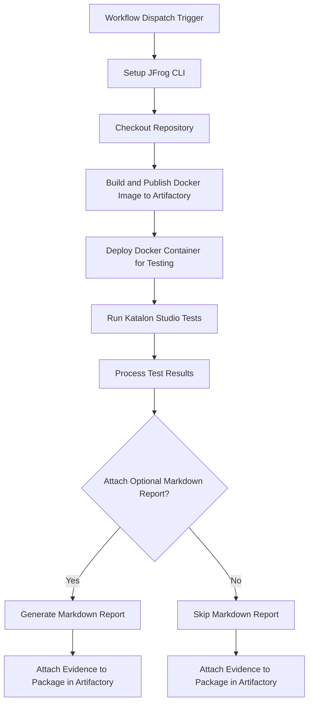

# **Katalon Studio Evidence Integration Example**

This repository provides a working example of a GitHub Actions workflow that automates **Katalon Studio** testing for Dockerized applications. It then attaches the resulting test results as signed, verifiable evidence to the package in **JFrog Artifactory**.

This workflow is an essential pattern for DevSecOps, creating a traceable, compliant, and secure software supply chain with comprehensive test coverage.

### **Key Features**

* **Automated Build & Deploy**: Builds a Windows-based Docker image from a Dockerfile and deploy it for testing.
* **Katalon Studio Testing**: Uses katalon-studio/katalon-studio-github-action to run automated tests against the application.
* **Evidence Generation**: Converts JUnit XML reports to JSON format for evidence attachment.
* **Optional Markdown Report**: Includes helper scripts to generate a human-readable Markdown summary from the Katalon test results.
* **Signed Evidence Attachment**: Attaches the test results to the corresponding package version in Artifactory using jf evd create, cryptographically signing it for integrity.
* **Katalon Studio**: [what Katalon Studio can test](https://docs.katalon.com/)

### **Workflow**

The following diagram illustrates the sequence of operations performed by the GitHub Actions workflow.



---

### **1. Prerequisites**

Before running this workflow, you must have:

* JFrog CLI 2.65.0 or above (installed automatically in the workflow)
* An Artifactory repository of type docker (e.g., docker-katalon-repo)
* A private key and a corresponding key alias configured in your JFrog Platform for signing evidence
* Katalon Studio project with test suites configured
* The following GitHub repository variables:
  * `JF_URL` (Artifactory Docker registry domain, e.g. `mycompany.jfrog.io`)
  * `ARTIFACTORY_URL` (Artifactory base URL)
* The following GitHub repository secrets:
  * `JF_ACCESS_TOKEN` (Artifactory access token)
  * `KATALON_API_KEY` (Katalon Studio API key for test execution)
  * `PRIVATE_KEY` (Private key for signing evidence)
  * `PRIVATE_KEY_ALIAS` (Key alias for signing evidence)

### Environment Variables Used

* `REGISTRY_URL` - Docker registry domain
* `REPO_NAME` - Docker repository name
* `IMAGE_NAME` - Docker image name
* `TAG_NAME` - Docker image tag (uses GitHub run number)
* `BUILD_NAME` - Build name for Artifactory
* `BUILD_NUMBER` - Build number (uses GitHub run number)
* `ATTACH_OPTIONAL_MARKDOWN_TO_EVIDENCE` - Set to `true` to attach a Markdown report as evidence
* `KATALON_VERSION` - Katalon Studio version to use

### **2. Configuration**

To use this workflow, you must configure the following GitHub Repository Secrets and Variables.

#### **GitHub Secrets**

Navigate to Settings > Secrets and variables > Actions and create the following secrets:

| Secret Name | Description |
| :---- | :---- |
| JF_ACCESS_TOKEN | A valid JFrog Access Token with permissions to read, write, and annotate in your target repository. |
| KATALON_API_KEY | Katalon Studio API key for test execution. |
| PRIVATE_KEY | The private key used to sign the evidence. This key corresponds to the alias configured in JFrog Platform. |
| PRIVATE_KEY_ALIAS | The key alias for signing evidence. |

#### **GitHub Variables**

Navigate to Settings > Secrets and variables > Actions and create the following variables:

| Variable Name | Description | Example Value |
| :---- | :---- | :---- |
| JF_URL | Artifactory Docker registry domain | mycompany.jfrog.io |
| ARTIFACTORY_URL | The Artifactory base URL | https://mycompany.jfrog.io |

#### **Workflow Environment Variables**

You can also customize the workflow's behavior by modifying the env block in the .github/workflows/katalon-evidence-example.yml file:

| Variable Name | Description | Default Value |
| :---- | :---- | :---- |
| REPO_NAME | The name of the target Docker repository in Artifactory. | docker-katalon-repo |
| IMAGE_NAME | The name of the Docker image to be built and pushed. | docker-katalon-image |
| BUILD_NAME | The name assigned to the build information in Artifactory. | katalon-docker-build |
| ATTACH_OPTIONAL_MARKDOWN_TO_EVIDENCE | Set to true to generate and attach a Markdown report alongside the JSON evidence. Set to false to skip this step. | true |
| KATALON_VERSION | The version of Katalon Studio to use for test execution. | 9.5.0 |

---

### **3. Usage**

This workflow is triggered manually.

1. Navigate to the **Actions** tab of your forked repository.
2. In the left sidebar, click on the **Katalon Studio evidence integration example** workflow.
3. Click the **Run workflow** dropdown button. You can leave the default branch selected.
4. Click the green **Run workflow** button.

Once the workflow completes successfully, you can navigate to your repository in Artifactory (docker-katalon-repo) and view the docker-katalon-image. Under the **Evidence** tab for the latest version, you will find the signed Katalon test results.

---

### **How It Works: A Step-by-Step Breakdown**

1. **Setup and Checkout**: The workflow begins by setting up the JFrog CLI and checking out the repository code.
2. **Build and Deploy Docker Image**: It uses standard docker commands to build a Windows-based image. The jf rt docker-push command then pushes this image to your Artifactory instance and associates it with build informationa dn deploy the image for testing.
3. **Run Katalon Studio Tests**: The katalon-studio/katalon-studio-github-action is executed against the application, running the specified test suite collection and generating JUnit XML reports.
4. **Process Test Results**: The workflow fetches test report paths and converts JUnit XML reports to JSON format for evidence attachment.
5. **Generate Optional Markdown Report**: If ATTACH\_OPTIONAL\_CUSTOM\_MARKDOWN\_TO\_EVIDENCE is true, a Python helper script is run to parse the JSON output and create a more human-readable katalon-results.md file.
6. **Attach Signed Evidence**: The final step uses the jf evd create command. It takes the katalon-results.json file as the official "predicate" and attaches it as evidence to the specific package version in Artifactory. The evidence is signed using the provided PRIVATE\_KEY, ensuring its authenticity and integrity.

### **Key Commands Used**

* **Build and Push Docker Image:**
  ```bash
  docker build . --file ./examples/katalon/Dockerfile --tag $REGISTRY_URL/$REPO_NAME/$IMAGE_NAME:$TAG_NAME
  jf rt docker-push $REGISTRY_URL/$REPO_NAME/$IMAGE_NAME:$TAG_NAME $REPO_NAME --build-name=$BUILD_NAME --build-number=$BUILD_NUMBER
  ```

* **Run Katalon Studio Tests:**
  ```yaml
  uses: katalon-studio/katalon-studio-github-action@v4.0
  with:
    version: ${{ env.KATALON_VERSION }}
    projectPath: '${{ github.workspace }}/examples/katalon'
    args: '-noSplash -retry=0 -testSuiteCollectionPath="Test Suites/Simple Test Suite Collection" -apiKey=${{ secrets.KATALON_API_KEY }} --config -webui.autoUpdateDrivers=true -reportFolder=reports'
  continue-on-error: true
  ```

* **Attach Evidence:**
  ```bash
  $commandArgs = @(
      "evd", "create",
      "--package-name", $packageName,
      "--package-version", $packageVersion,
      "--package-repo-name", $packageRepoName,
      "--key", $privateKey, 
      "--key-alias", $privateKeyAlias,
      "--predicate", $predicatePath,
      "--predicate-type", $predicateType
  )
  if ("${{ env.ATTACH_OPTIONAL_MARKDOWN_TO_EVIDENCE }}" -eq "true") {
    $commandArgs += @("--markdown", "reports\katalon-results.md")
  }
  jf $commandArgs
  ```

### **References**

* [Katalon Studio Documentation](https://docs.katalon.com/)
* [JFrog Evidence Management](https://jfrog.com/help/r/jfrog-artifactory-documentation/evidence-management)
* [JFrog CLI Documentation](https://jfrog.com/getcli/)