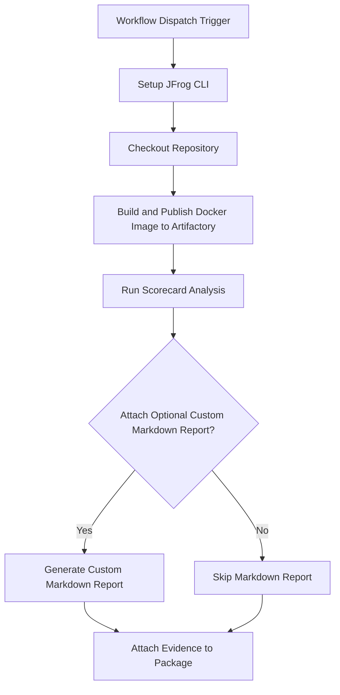

# Scorecard Security Scan Evidence Example

This example demonstrates how to automate Scorecard security scanning for Docker images and attach the scan results as
signed evidence to the image in JFrog Artifactory using GitHub Actions and JFrog CLI.

## Overview

The workflow builds a Docker image, scans it with Scorecard for security and quality metrics, pushes the image to Artifactory, and
attaches the Scorecard scan results as evidence to the image package. This enables traceability and compliance for security
scanning in your CI/CD pipeline.

## Prerequisites

- JFrog CLI 2.65.0 or above (installed automatically in the workflow)
- Artifactory configured as a Docker registry
- The following GitHub repository variables:
    - `REGISTRY_DOMAIN` (Artifactory Docker registry domain, e.g. `mycompany.jfrog.io`)
    - `ARTIFACTORY_URL` (Artifactory base URL)
    - `EVIDENCE_KEY_ALIAS` (Key alias for signing evidence)
- The following GitHub repository secrets:
    - `ARTIFACTORY_ACCESS_TOKEN` (Artifactory access token)
    - `PRIVATE_KEY` (Private key for signing evidence)

## Environment Variables Used

- `REGISTRY_DOMAIN` - Docker registry domain

## Workflow



## Example Usage

You can trigger the workflow manually from the GitHub Actions tab. The workflow will:

- Build and scan the Docker image
- Push the image to Artifactory
- Attach the Scorecard scan results as evidence

## Key Commands Used

- **Build Docker Image:**
  ```bash
  docker build . --file ./examples/scorecard/Dockerfile --tag $REGISTRY_URL/$REPO_NAME/$IMAGE_NAME:$VERSION
  ```
- **Run Scorecard Analysis:**
  ```yaml
  uses: ossf/scorecard-action@v2.4.2
  with:
    results_file: scorecard-results.sarif
    results_format: sarif
    publish_results: false
  ```
- **Push Docker Image:**
  ```bash
  jf rt docker-push $REGISTRY_URL/$REPO_NAME/$IMAGE_NAME:$VERSION $REPO_NAME --build-name=$BUILD_NAME --build-number=${{ github.run_number }}
  ```
- **Attach Evidence:**
  ```bash
  jf evd create \
    --package-name $IMAGE_NAME \
    --package-version $VERSION \
    --package-repo-name $REPO_NAME \
    --key "${{ secrets.PRIVATE_KEY }}" \
    --key-alias "${{ vars.EVIDENCE_KEY_ALIAS }}" \
    --predicate ./scorecard-results.sarif \
    --predicate-type http://openssf.org/scorecard/security-scan/v1 \
    ${{ env.ATTACH_OPTIONAL_CUSTOM_MARKDOWN_TO_EVIDENCE == 'true' && '--markdown "scorecard-results.md"' || '' }}
  ```

## References

- [Scorecard Documentation](https://github.com/ossf/scorecard)
- [JFrog Evidence Management](https://jfrog.com/help/r/jfrog-artifactory-documentation/evidence-management)
- [JFrog CLI Documentation](https://jfrog.com/getcli/)
