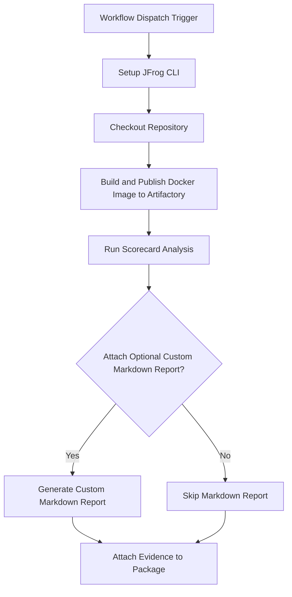

# Scorecard Security Scan Evidence Example

This repository provides a working example of a GitHub Actions workflow that automatically evaluates a repository against the Open Source Security Foundation (OSSF) Scorecard checks. It then attaches the resulting security health-check report as signed, verifiable evidence to a Docker image in JFrog Artifactory.

This workflow provides a powerful way to measure and track your project's adherence to security best practices, creating an auditable record linked directly to a software build.

## Overview

The workflow builds a Docker image, scans it with Scorecard for security and quality metrics, pushes the image to Artifactory, and
attaches the Scorecard scan results as evidence to the image package. This enables traceability and compliance for security
scanning in your CI/CD pipeline.

### **Key Features**

* **Automated Build**: Builds a Docker image from a `Dockerfile` to serve as the subject for the evidence.  
* **Security Health Analysis**: Uses the `ossf/scorecard-action` to evaluate the repository against checks like "Branch-Protection", "Code-Review", "SAST", and more.  
* **SARIF Output**: Generates an industry-standard SARIF file detailing the results of the Scorecard analysis.  
* **Optional Markdown Summary**: Includes a helper script to generate a human-readable Markdown report from the SARIF data.  
* **Signed Evidence Attachment**: Attaches the SARIF report as a predicate to the corresponding Docker image in Artifactory, cryptographically signing it for integrity.

## Prerequisites

- JFrog CLI 2.65.0 or above (installed automatically in the workflow)
- Artifactory configured as a Docker registry
- The following GitHub repository variables:
    - `REGISTRY_DOMAIN` (Artifactory Docker registry domain, e.g. `mycompany.jfrog.io`)
    - `ARTIFACTORY_URL` (Artifactory base URL)
    - `EVIDENCE_KEY_ALIAS` (Key alias for signing evidence)
- The following GitHub repository secrets:
    - `ARTIFACTORY_ACCESS_TOKEN` (Artifactory access token)
    - `PRIVATE_KEY` (Private key for signing evidence)

## Environment Variables Used

- `REGISTRY_DOMAIN` - Docker registry domain

## Workflow



## Example Usage

You can trigger the workflow manually from the GitHub Actions tab. The workflow will:

- Build and scan the Docker image
- Push the image to Artifactory
- Attach the Scorecard scan results as evidence

## Key Commands Used


- **Build Docker Image:**
  The workflow first builds a Docker image and pushes it to your Artifactory instance. This image acts as the "subject" to which the Scorecard evidence will be attached. It also publishes the associated build information.
  
  ```bash
  docker build . --file ./examples/scorecard/Dockerfile --tag $REGISTRY_URL/$REPO_NAME/$IMAGE_NAME:$VERSION
  ```
- **Run Scorecard Analysis:**
  This step uses the `ossf/scorecard-action` to evaluate the repository's security posture. The results, including the score and details for each check, are saved as a SARIF file. The `publish_results: false` parameter is important, as it prevents the action from uploading results to the GitHub Security tab, allowing us to attach them as evidence instead.
  
  ```yaml
  uses: ossf/scorecard-action@v2.4.2
  with:
    results_file: scorecard-results.sarif
    results_format: sarif
    publish_results: false
  ```
- **Push Docker Image:**
  ```bash
  jf rt docker-push $REGISTRY_URL/$REPO_NAME/$IMAGE_NAME:$VERSION $REPO_NAME --build-name=$BUILD_NAME --build-number=${{ github.run_number }}
  ```
- **Attach Evidence:**
  This final step uses jf evd create to attach the Scorecard analysis to the Docker image built earlier. The SARIF file serves as the official, machine-readable predicate, while the optional Markdown report provides a summary for easy viewing in the Artifactory UI.
  
  ```bash
  jf evd create \
    --package-name $IMAGE_NAME \
    --package-version $VERSION \
    --package-repo-name $REPO_NAME \
    --key "${{ secrets.PRIVATE_KEY }}" \
    --key-alias "${{ vars.EVIDENCE_KEY_ALIAS }}" \
    --predicate ./scorecard-results.sarif \
    --predicate-type http://openssf.org/scorecard/security-scan/v1 \
    ${{ env.ATTACH_OPTIONAL_CUSTOM_MARKDOWN_TO_EVIDENCE == 'true' && '--markdown "scorecard-results.md"' || '' }}
  ```

## References

- [Scorecard Documentation](https://github.com/ossf/scorecard)
- [JFrog Evidence Management](https://jfrog.com/help/r/jfrog-artifactory-documentation/evidence-management)
- [JFrog CLI Documentation](https://jfrog.com/getcli/)
