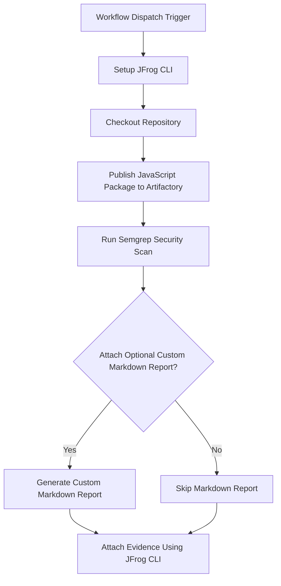

# Semgrep Security Scan Evidence Example

This example demonstrates how to automate Semgrep security scanning for JavaScript code and attach the scan results as signed evidence to the package in JFrog Artifactory using GitHub Actions and JFrog CLI.

## Overview

The workflow scans JavaScript code with Semgrep for security issues, publishes the package to Artifactory, and attaches the Semgrep scan results as evidence to the package. This enables traceability and compliance for security scanning in your CI/CD pipeline.

## Prerequisites

- JFrog CLI 2.65.0 or above (installed automatically in the workflow)
- Artifactory configured as a repository
- The following GitHub repository variables:
    - `ARTIFACTORY_URL` (Artifactory base URL)
    - `EVIDENCE_KEY_ALIAS` (Key alias for signing evidence)
- The following GitHub repository secrets:
    - `ARTIFACTORY_ACCESS_TOKEN` (Artifactory access token)
    - `PRIVATE_KEY` (Private key for signing evidence)

## Environment Variables Used

- `ATTACH_OPTIONAL_CUSTOM_MARKDOWN_TO_EVIDENCE` - Whether to attach a custom markdown report to the evidence

## Workflow



## Example Usage

You can trigger the workflow manually from the GitHub Actions tab. The workflow will:

- Scan the JavaScript code
- Publish the package to Artifactory
- Attach the Semgrep scan results as evidence

## Key Commands Used

- **Publish JavaScript Package:**
  ```bash
  jf npm-config --repo-resolve=javascript-remote --repo-deploy=javascript-local \
    --server-id-deploy=setup-jfrog-cli-server \
    --server-id-resolve=setup-jfrog-cli-server
  jf npm publish --build-name=js-semgrep-sample-build --build-number=${{ github.run_number }}
  jf rt bp js-semgrep-sample-build ${{ github.run_number }}
  ```
- **Run Semgrep Scan:**
  ```bash
  semgrep scan -q --sarif --config auto ./examples/semgrep/js > semgrep-results.sarif
  ```
- **Attach Evidence:**
  ```bash
  jf evd create \
    --package-name js-semgrep-sample-build \
    --package-version "0.0.1" \
    --package-repo-name javascript-local \
    --key "${{ secrets.PRIVATE_KEY }}" \
    --key-alias "${{ vars.EVIDENCE_KEY_ALIAS }}" \
    --predicate "results-javascript/javascript.sarif" \
    --predicate-type "http://semgrep.com/security-scan/v1" \
    ${{ env.ATTACH_OPTIONAL_CUSTOM_MARKDOWN_TO_EVIDENCE == 'true' && '--markdown "results-javascript/javascript-report.md"' || '' }}
  ```

## References

- [Semgrep Documentation](https://semgrep.dev/docs/)
- [JFrog Evidence Management](https://jfrog.com/help/r/jfrog-artifactory-documentation/evidence-management)
- [JFrog CLI Documentation](https://jfrog.com/getcli/)