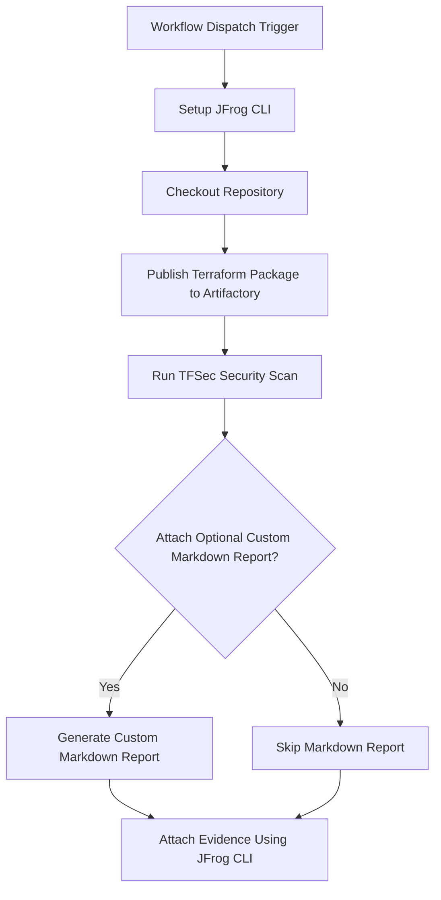

# TFSec Security Scan Evidence Example

This example demonstrates how to automate TFSec security scanning for Terraform code and attach the scan results as
signed evidence to the package in JFrog Artifactory using GitHub Actions and JFrog CLI.

## Overview

The workflow scans Terraform code with TFSec for security issues, publishes the package to Artifactory, and
attaches the TFSec scan results as evidence to the package. This enables traceability and compliance for security
scanning in your CI/CD pipeline.

## Prerequisites

- JFrog CLI 2.65.0 or above (installed automatically in the workflow)
- Artifactory configured as a repository
- The following GitHub repository variables:
    - `ARTIFACTORY_URL` (Artifactory base URL)
    - `EVIDENCE_KEY_ALIAS` (Key alias for signing evidence)
- The following GitHub repository secrets:
    - `ARTIFACTORY_ACCESS_TOKEN` (Artifactory access token)
    - `PRIVATE_KEY` (Private key for signing evidence)

## Environment Variables Used

- `ATTACH_OPTIONAL_CUSTOM_MARKDOWN_TO_EVIDENCE` - Whether to attach a custom markdown report to the evidence

## Workflow



## Example Usage

You can trigger the workflow manually from the GitHub Actions tab. The workflow will:

- Scan the Terraform code
- Publish the package to Artifactory
- Attach the TFSec scan results as evidence

## Key Commands Used

- **Publish Terraform Package:**
  ```bash
  jf tfc --repo-deploy tf-local \
    --server-id-deploy setup-jfrog-cli-server
  jf tf p --namespace example \
    --provider aws \
    --tag v0.0.${{ github.run_number }} \
    --build-name my-tf-build \
    --build-number ${{ github.run_number }}
  jf rt bp my-tf-build ${{ github.run_number }}
  ```
- **Run TFSec Scan:**
  ```yaml
  uses: aquasecurity/tfsec-action@v1.0.0
  with:
    additional_args: --format json --out tfsec.json
    soft_fail: true
  ```
- **Attach Evidence:**
  ```bash
  jf evd create \
    --build-name my-tf-build \
    --build-number ${{ github.run_number }} \
    --key "${{ secrets.PRIVATE_KEY }}" \
    --key-alias "${{ vars.EVIDENCE_KEY_ALIAS }}" \
    --predicate ./tfsec.json \
    --predicate-type http://aquasec.com/tfsec/security-scan \
    ${{ env.ATTACH_OPTIONAL_CUSTOM_MARKDOWN_TO_EVIDENCE == 'true' && '--markdown "tfsec.md"' || '' }}
  ```

## References

- [TFSec Documentation](https://aquasecurity.github.io/tfsec/)
- [JFrog Evidence Management](https://jfrog.com/help/r/jfrog-artifactory-documentation/evidence-management)
- [JFrog CLI Documentation](https://jfrog.com/getcli/)
