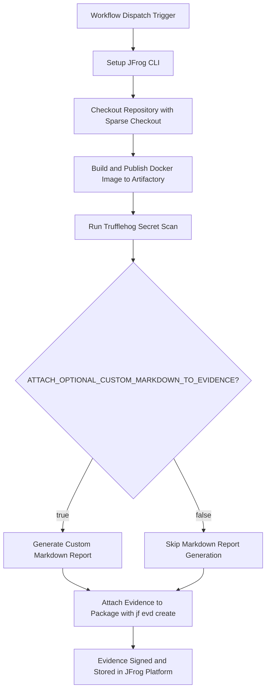

# **Trufflehog Secret Scan Evidence Example**

This repository provides a working example of a GitHub Actions workflow that automates secret scanning using **Trufflehog**. It then attaches the resulting secret detection report as signed, verifiable evidence to the package in **JFrog Artifactory**.

This workflow is an essential pattern for DevSecOps, creating a traceable, compliant, and secure software supply chain by detecting and documenting potential secrets in your codebase.

### **Key Features**

* **Automated Secret Scanning**: Uses Trufflehog to scan the repository for potential secrets and sensitive information.
* **Comprehensive Detection**: Scans for various types of secrets including API keys, passwords, tokens, and other sensitive data.
* **Evidence Generation**: Creates a structured predicate file from Trufflehog scan results.
* **Optional Markdown Report**: Includes a helper script to generate a human-readable Markdown summary from the Trufflehog JSON results.
* **Signed Evidence Attachment**: Attaches the scan results to the corresponding package version in Artifactory using jf evd create, cryptographically signing it for integrity.
* **Trufflehog**: [what Trufflehog can detect](https://github.com/trufflesecurity/trufflehog)

### **Workflow**

The following diagram illustrates the sequence of operations performed by the GitHub Actions workflow.



---

### **1\. Prerequisites**

Before running this workflow, you must have:

* JFrog CLI 2.65.0 or above (installed automatically in the workflow)  
* An Artifactory repository configured for your project.
* A private key and a corresponding key alias configured in your JFrog Platform for signing evidence.  
* The following GitHub repository variables:  
  * `JF_URL` (JFrog Platform base URL, e.g. `https://mycompany.jfrog.io`)  
  * `JF_SIGNING_KEY_ALIAS` (Key alias for signing evidence)
* The following GitHub repository secrets:  
  * `JF_ACCESS_TOKEN` (JFrog access token with evidence upload permissions)  
  * `JF_PRIVATE_KEY` (Private key for signing evidence)

### Environment Variables Used

* `ATTACH_OPTIONAL_CUSTOM_MARKDOWN_TO_EVIDENCE` - Controls whether to generate and attach a Markdown report

### **2\. Configuration**

To use this workflow, you must configure the following GitHub Repository Secrets and Variables.

#### **GitHub Secrets**

Navigate to Settings \> Secrets and variables \> Actions and create the following secrets:

| Secret Name | Description |
| :---- | :---- | 
| JF_ACCESS_TOKEN | A valid JFrog Access Token with permissions to read, write, and annotate in your target repository. | 
| JF_PRIVATE_KEY | The private key used to sign the evidence. This key corresponds to the alias configured in JFrog Platform. |

#### **GitHub Variables**

Navigate to Settings \> Secrets and variables \> Actions and create the following variables:

| Variable Name | Description | Example Value |
| :---- | :---- | :---- |
| JF_URL | The base URL of your JFrog Platform instance. | https://mycompany.jfrog.io |
| JF_SIGNING_KEY_ALIAS | The alias for the public key in JFrog Platform used to verify the evidence signature. | my-signing-key-alias |

#### **Workflow Environment Variables**

You can also customize the workflow's behavior by modifying the env block in the .github/workflows/trufflehog-evidence-example.yml file:

| Variable Name | Description | Default Value |
| :---- | :---- | :---- |
| ATTACH_OPTIONAL_CUSTOM_MARKDOWN_TO_EVIDENCE | Set to true to generate and attach a Markdown report alongside the JSON evidence. Set to false to skip this step. | true |

---

### **3\. Usage**

This workflow is triggered manually.

1. Navigate to the **Actions** tab of your forked repository.  
2. In the left sidebar, click on the **Trufflehog Scan and JFrog Evidence** workflow.  
3. Click the **Run workflow** dropdown button. You can leave the default branch selected.  
4. Click the green **Run workflow** button.

Once the workflow completes successfully, you can navigate to your repository in Artifactory and view the evidence. Under the **Evidence** tab for the latest version, you will find the signed Trufflehog scan results.

### **How It Works: A Step-by-Step Breakdown**

1. **Setup and Checkout**: The workflow begins by setting up the JFrog CLI and checking out the repository code using sparse checkout to focus on the trufflehog example directory.
2. **Run Trufflehog Secret Scan**: Uses Docker to run Trufflehog against the repository, scanning for potential secrets and sensitive information. The scan outputs results in JSON format.
3. **Process Scan Results**: A Python helper script (`process_trufflehog_results.py`) parses the Trufflehog JSON output and generates a structured predicate file suitable for JFrog Evidence.
4. **Generate Optional Markdown Report**: If ATTACH_OPTIONAL_CUSTOM_MARKDOWN_TO_EVIDENCE is true, the Python script creates a human-readable Markdown report summarizing the findings.
5. **Attach Signed Evidence**: The final step uses the jf evd create command to attach the scan results as evidence to the specific package version in Artifactory. The evidence is signed using the provided private key, ensuring its authenticity and integrity.

### **Key Commands Used**

* **Run Trufflehog Scan:**

```bash
docker run --rm -it -v "$PWD:/pwd" trufflesecurity/trufflehog:latest filesystem /pwd --json
```

* **Process Results:**

```bash
python process_trufflehog_results.py trufflehog-results.json
```

* **Attach Evidence:**

```bash
jf evd create \
  --package-name your-package-name \
  --package-version your-version \
  --package-repo-name your-repo-name \
  --key "${{ secrets.JF_PRIVATE_KEY }}" \
  --key-alias ${{ vars.JF_SIGNING_KEY_ALIAS }} \
  --predicate ./trufflehog-evidence.json \
  --predicate-type http://trufflesecurity.com/trufflehog/secret-scan
```

### **References**

* [Trufflehog Documentation](https://github.com/trufflesecurity/trufflehog)  
* [JFrog Evidence Management](https://jfrog.com/help/r/jfrog-artifactory-documentation/evidence-management)  
* [JFrog CLI Documentation](https://jfrog.com/getcli/)